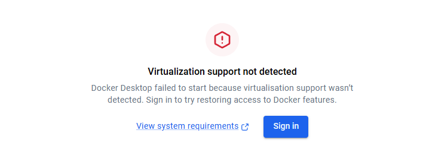
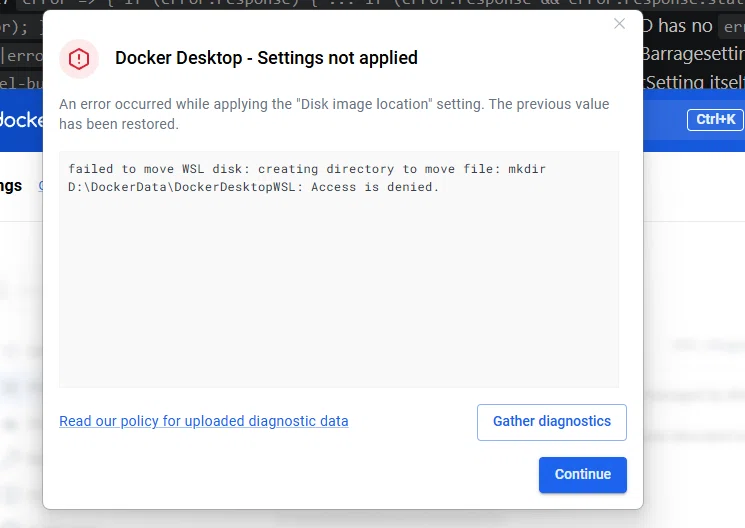

[lanhu-mcp](https://github.com/dsphper/lanhu-mcp)  

# 手动安装：`Docker`部署（推荐）  
## 1.下载`Docker`  

#### 安装`Docker`出现问题：
  
###### Docker 提示“Virtualization support not detected”  
报错原因：`Docker` 提示“`Virtualization support not detected`”，通常意味着底层硬件虚拟化功能未被正确开启或传递。这并非 `Docker` 软件本身的缺陷，而是其依赖的虚拟化技术链（硬件 `BIOS` → 操作系统 → 虚拟化平台）中某个环节出现了断开。  
+ 第一步：检查并开启 `BIOS` 虚拟化  
你可以先通过任务管理器快速检查：按 `Ctrl + Shift + Esc`，切换到“性能”选项卡，点击“CPU”，查看右下角“虚拟化”一项是否显示为“已启用”。如果显示“已禁用”，则需要重启电脑进入 `BIOS`（通常按 `Del`、`F2` 或 `F10` 等键），找到 `Intel Virtualization Technology（Intel）`或 `SVM Mode（AMD）`选项并将其设为 `Enabled`。 
+ 第二步：启用必要的 `Windows` 功能与命令
如果 `BIOS` 已开启，但问题依旧，请以管理员身份打开命令提示符（`CMD`）或 `PowerShell`，依次执行以下两条命令，然后重启电脑：  
```bash
dism.exe /Online /Enable-Feature:Microsoft-Hyper-V /All
bcdedit /set hypervisorlaunchtype auto
```  
你也可以通过“启用或关闭 `Windows` 功能”对话框，手动勾选 `Hyper-V`、虚拟机平台和 `Windows 子系统 Linux（WSL）`。对于 Windows 家庭版用户，默认可能没有 Hyper-V，上述 dism 命令通常能强制安装所需组件。   

虚拟机平台（`Virtual Machine Platform`）和 适用于`Linux`的`Windows`子系统（`WSL`）两个开关的作用  
这两个选项都是`Windows`系统底层的**虚拟化功能**，它们为你在电脑上运行"非`Windows`系统"提供基础支持。简单来说，它们是让你在`Windows`里顺畅使用`Linux`和轻量级虚拟机的"地基"。  
+ 1. 虚拟机平台（`Virtual Machine Platform`）
   + 控制什么：它是`Windows`提供的一个底层虚拟化基础架构。  
   + 具体作用：它负责提供运行轻量级虚拟机的能力。很多现代`Windows`功能都依赖它，比如：  
      + 它负责提供运行轻量级虚拟机的能力。很多现代`Windows`功能都依赖它，比如：  
      + `WSL 2`(`WSL`的第二代架构，目前默认使用)。
      + `Windows`沙盒（`Windows Sandbox`,用于安全测试软件）。
      + `Hyper-V`(微软自家的企业级虚拟机)。 
      + `Docker Desktop`（很多容器技术依赖它）。  

它就像是电脑里的"地基"，有了它，才能在上面盖起各种不同系统的"房子"。  

+ 2.适用于`Linux`的`Windows`子系统（`WSL`）  
   + **控制什么**：它是允许`Windows`原生运行`Linux`环境（包括命令行工具，使用程序甚至图形界面应用）的兼容层。  
   + **具体作用**：开启后，你可以直接在`Windows`里打开`Ubuntu`、`Debian`等`Linux`发行版，使用`apt`、`grep`、`python`等`Linux`命令，而不需要安装双系统或传统笨重的虚拟机。  
   + 重点区别：
      + 如果你只想要`WSL1`(老版本，翻译层架构)，只需开启这个即可。  
      + 如果你想要`WSL2`(新版本，性能更好，支持完整的`Linux`内核)，必须同时开启"虚拟机平台"。
   + 它们俩的关系总结  
      + "适用于`Linux`的`Windows`子系统"是**目的**：我想在`Windows`上用`Linux`。  
      + "虚拟机平台"是手段：为了跑得更好（`WSL2`）,我需要底层虚拟化技术来支撑。   
   为什么要开这两个？  
   通常是因为你在安装`WSL2`(现在默认安装的就是`WSL2`),或者在使用`Docker`、安卓模拟器等需要虚拟化支持的工具。如果只开`WSL`而不开虚拟机平台，当输入`wsl --install`时，系统会报错误提示缺少依赖。

“适用于 Linux 的 Windows 子系统”（WSL） 版本过旧
[WSL更新提示](./image/WSL.png)  
执行`wsl --update`完成更新  

+ 第三步：确保`WSL 2`正确配置  
`Docker Desktop` 在 `Windows` 上默认使用 `WSL 2` 作为后端。请确保已安装 `WSL 2` 内核更新包，并在 `Docker Desktop` 的 设置 → 常规 中勾选“`Use the WSL 2 based engine`”，同时在 `Resources → WSL Integration` 中启用你的 Linux 发行版。

  

解决方法，按以下步骤操作：  
1.手动创建文件夹:打开电脑的 `D` 盘，手动新建文件夹 `DockerData`，然后在里面再新建一个 `DockerDesktopWSL` 文件夹。（也就是手动建好 `D:\DockerData\DockerDesktopWSL` 这个路径）。
2.检查`D`盘格式：右键 `D` 盘 -> 属性，确认“文件系统”是 `NTFS`。如果是 `exFAT` 或 `FAT32`，你需要格式化 `D` 盘才能用（或者换个盘）。
3.赋予权限：右键刚刚创建的 `DockerData` 文件夹 -> 属性 -> 安全 -> 编辑，把你的用户账户和 SYSTEM 权限都勾选“完全控制”，然后确定。
4.以管理员身份重启`Docker`:在开始菜单找到 `Docker Desktop`，右键选择“以管理员身份运行”。
5.再次进入 `Docker` 设置 -> `Resources` -> `Advanced`，尝试修改 `Disk image location` 到刚刚创建的 `D:\DockerData\DockerDesktopWSL`，然后 `Apply & Restart`。  

+ 第一步：确保系统已经安装并更新`WSL`2  
这是基础，需要确认 `Windows` 版本符合要求并安装 `WSL 2` 内核。
1.检查系统版本：确保你的 `Windows` 是 `Windows 10` 版本 `2004`（内部版本 `19041`）或更高，或者 `Windows 1`1。这是运行 `WSL 2` 的前提。  
2.一键安装`WSL`:以管理员身份打开 PowerShell（在开始菜单搜索“PowerShell”，右键选择“以管理员身份运行”），输入以下命令并回车：  
```powershell  
wsl --install
```  
这个命令会自动启动所需的`Windows`功能，下载最新的`Linux`内核，并默认安装`Ubuntu`发行版，安装完成后，**重启计算机**。  
3.**更新内核（可选但推荐）**：重启后，再次以管理员身份打开`PowerShell`,运行以下命令确保内核是最新版：  
```powershell
wsl --update
```  
如果系统提示已是最新版本，说明内核已就绪。   
+ 第二步：在`Docker Desktop`中启用`WSL 2`后端   
1.系统准备好后，需要告诉 `Docker Desktop` 使用 `WSL 2` 作为其运行引擎。
打开 `Docker Desktop`，点击右上角的齿轮图标进入 `Settings`（设置）。
2.在左侧菜单选择 `General`（常规）。
3.在右侧找到并勾选 “`Use the WSL 2 based engine`”（使用基于 `WSL 2` 的引擎）。如果你的系统满足条件，这个选项通常是默认勾选的。
4.点击右下角的 “`Apply & Restart`” 使设置生效。  

+ 第三步：配置`WSL`集成，连接你的`Linux`发行版  
这一步是为了让`Docker`命令能再你指定的`Linux`发行版中直接使用。
1.在 `Docker Desktop 的 Settings`（设置） 中，切换到左侧的 `Resources`（资源） 选项卡。  
2.选择 `WSL Integration`（`WSL` 集成）。
3.在"`Enable integration with my default WSL distro`"（启用与我的默认 `WSL` 发行版的集成）下方，找到你安装的 `Linux` 发行版（如 `Ubuntu`），并勾选它旁边的开关。  
4.再次点击 “`Apply & Restart`” 保存配置。  

继续前往 `Resources（资源`） -> `WSL Integration`（`WSL` 集成），勾选你安装的 `Linux` 发行版（比如 `Ubuntu`），然后再次点击 `Apply & Restart`了，这里什么意思啊，安装`wsl`不是默认安装 `Ubuntu`了吗？这个配置起到什么作用啊？

   +  为什么 `wsl --install` 没给我装 `Ubuntu`？  
   `wsl --install`在较新的`Windows`系统上**确实会尝试默认安装`Ubuntu`**,但为什么你在这里看不到呢？因为以下两个原因：  
   1.**之前的`wsl -l -v`截图暴露了真相**：列表里只有`docker-desktop`。这说明当前电脑里真的没有**成功安装`Ubuntu`**(可能是下载中断了，也可能是你的`Windows`版本比较老)，`wsl --install`只帮你安装了底层内核，没有装`Ubuntu`这个具体的系统）。  
   2.`Docker`这里的判断标准很严格：它只认"用户自己安装且已完成初始化"的`Linux`系统。  
   如果你装了 `Ubuntu`，但从来没有打开过它，没有设置过 `Linux` 的用户名和密码，`Docker` 就会认为它“没装好”，自然也就不会显示在这里。至于自带的 `docker-desktop`，那是 `Docker` 自己的内部系统，不算“你的 `Linux` 发行版”。
   **如果你想让`Ubuntu`出现在这里，你需要做**： 
   1.管理员身份打开 `PowerShell`，输入：`wsl --install -d Ubuntu`
   2.安装完，在开始菜单里打开 `Ubuntu`，跟着提示设置一个 `Linux` 用户名和密码。
   3.回到 `Docker` 的这个界面，点击 `Refetch distros`，它就会出现了。
   + 这个`WSL Integration`配置到底起什么作用？  
   简单说：它是为了让你能在`Ubuntu`里面直接敲`docker`命令。   

+ 第四步：配置`docker`镜像源地址  
`registry-mirrors`  配置的详细步骤，这个配置对 `Docker Desktop` 全局生效。  
1.打开设置：右键点击系统托盘里的 `Docker` 图标，选择 `Settings`。
2.编辑配置：在左侧菜单选择 `Docker Engine`。在右侧的 `JSON` 配置框里，找到 "`registry-mirrors`" 这个键（如果没有就手动加上），然后把下面的地址加进去：  
```json
{
  "registry-mirrors": [
    "https://docker.xuanyuan.me",
    "https://docker.1ms.run",
    "https://docker.m.daocloud.io",
    "https://registry-1.docker.io"
  ]
}
```   
建议配置2-3个加速源，并保留官方源`https://registry-1.docker.io`作为最终兜底，避免单个源失效时影响使用。  
3.应用并重启：点击右下角的`Apply & Restart`,等待`Docker`重启完成。  
4.验证配置：重启后，在 `PowerShell` 里运行下面的命令，能看到你配置的加速地址就说明成功了：  
```poswershell  
docker info | findstr /i "Registry Mirrors"
```
# 拓展  
## BIOS/UEFI   这个是干什么的？
**BIOS/UEFI 是主板上的一段“固件”程序**，可以理解成电脑开机时的“底层管家 + 启动引导员”。它不是操作系统，但负责把电脑从“刚通电”带到“能启动 Windows/Linux”。

### 它主要干什么？
1. **开机自检 POST**  
   通电后先检查 CPU、内存、显卡、硬盘、键盘等硬件是否正常。

2. **初始化硬件**  
   让内存、芯片组、硬盘、USB、风扇等进入可用状态。

3. **读取启动设置**  
   比如启动顺序、系统时间、虚拟化开关、安全启动等。

4. **寻找并启动操作系统**  
   按启动顺序找硬盘、U盘、网络等设备，读取引导程序，然后把控制权交给 Windows/Linux。

5. **提供设置界面**  
   开机按 `Del`、`F2`、`F12`、`Esc` 等键可进入 BIOS/UEFI 设置，用来改启动项、开虚拟化、调风扇、超频、恢复默认等。

### BIOS 和 UEFI 的区别
- **BIOS**：老式固件，文字界面，通常用 MBR 分区，引导盘最大约 2TB，速度慢。
- **UEFI**：现代固件，图形界面，支持鼠标，支持 GPT 大硬盘、快速启动、安全启动，功能更强。
- 现在新电脑基本都用 **UEFI**，但很多人习惯仍叫它“BIOS”。很多主板还有 **CSM/Legacy 兼容模式**，用来模拟老 BIOS。

### 常见用途
- 重装系统时设置 U 盘启动
- 开启 CPU 虚拟化，用于虚拟机
- 开启/关闭 Secure Boot
- 查看硬件信息、温度、风扇转速
- 恢复默认设置、更新固件

### 注意
BIOS/UEFI 设置乱改可能导致电脑开不了机或进不了系统。如果出问题，可以进设置选“恢复默认/Load Optimized Defaults”，或清 CMOS。

**一句话：BIOS/UEFI 就是电脑开机时最先运行的固件，负责检查硬件、初始化设备，并找到操作系统把它启动起来。**  
## 固件是什么  
**固件 = 出厂就“焊”在硬件芯片里的软件。**
它不像 `Windows` 那样装在硬盘里，而是提前写进主板上的一个小芯片里。

`BIOS/UEFI` 就是主板的固件。
你可以把它理解成：**主板自带的一段“开机专用小程序”**。