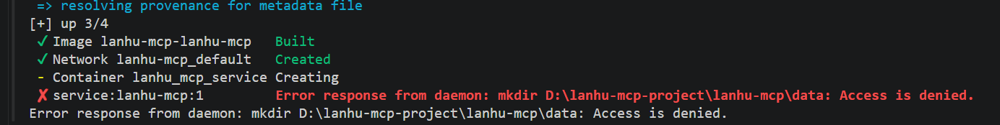
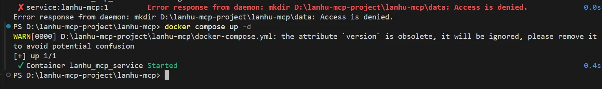

[lanhu-mcp](https://github.com/dsphper/lanhu-mcp)  

# 手动安装：`Docker`部署（推荐）  
## 1.下载`Docker`  

#### 安装`Docker`出现问题：
  
###### Docker 提示“Virtualization support not detected”  
报错原因：`Docker` 提示“`Virtualization support not detected`”，通常意味着底层硬件虚拟化功能未被正确开启或传递。这并非 `Docker` 软件本身的缺陷，而是其依赖的虚拟化技术链（硬件 `BIOS` → 操作系统 → 虚拟化平台）中某个环节出现了断开。  
+ 第一步：检查并开启 `BIOS` 虚拟化  
你可以先通过任务管理器快速检查：按 `Ctrl + Shift + Esc`，切换到“性能”选项卡，点击“CPU”，查看右下角“虚拟化”一项是否显示为“已启用”。如果显示“已禁用”，则需要重启电脑进入 `BIOS`（通常按 `Del`、`F2` 或 `F10` 等键），找到 `Intel Virtualization Technology（Intel）`或 `SVM Mode（AMD）`选项并将其设为 `Enabled`。 
+ 第二步：启用必要的 `Windows` 功能与命令
如果 `BIOS` 已开启，但问题依旧，请以管理员身份打开命令提示符（`CMD`）或 `PowerShell`，依次执行以下两条命令，然后重启电脑：  
```bash
dism.exe /Online /Enable-Feature:Microsoft-Hyper-V /All
bcdedit /set hypervisorlaunchtype auto
```  
你也可以通过“启用或关闭 `Windows` 功能”对话框，手动勾选 `Hyper-V`、虚拟机平台和 `Windows 子系统 Linux（WSL）`。对于 Windows 家庭版用户，默认可能没有 Hyper-V，上述 dism 命令通常能强制安装所需组件。   

虚拟机平台（`Virtual Machine Platform`）和 适用于`Linux`的`Windows`子系统（`WSL`）两个开关的作用  
这两个选项都是`Windows`系统底层的**虚拟化功能**，它们为你在电脑上运行"非`Windows`系统"提供基础支持。简单来说，它们是让你在`Windows`里顺畅使用`Linux`和轻量级虚拟机的"地基"。  
+ 1. 虚拟机平台（`Virtual Machine Platform`）
   + 控制什么：它是`Windows`提供的一个底层虚拟化基础架构。  
   + 具体作用：它负责提供运行轻量级虚拟机的能力。很多现代`Windows`功能都依赖它，比如：  
      + 它负责提供运行轻量级虚拟机的能力。很多现代`Windows`功能都依赖它，比如：  
      + `WSL 2`(`WSL`的第二代架构，目前默认使用)。
      + `Windows`沙盒（`Windows Sandbox`,用于安全测试软件）。
      + `Hyper-V`(微软自家的企业级虚拟机)。 
      + `Docker Desktop`（很多容器技术依赖它）。  

它就像是电脑里的"地基"，有了它，才能在上面盖起各种不同系统的"房子"。  

+ 2.适用于`Linux`的`Windows`子系统（`WSL`）  
   + **控制什么**：它是允许`Windows`原生运行`Linux`环境（包括命令行工具，使用程序甚至图形界面应用）的兼容层。  
   + **具体作用**：开启后，你可以直接在`Windows`里打开`Ubuntu`、`Debian`等`Linux`发行版，使用`apt`、`grep`、`python`等`Linux`命令，而不需要安装双系统或传统笨重的虚拟机。  
   + 重点区别：
      + 如果你只想要`WSL1`(老版本，翻译层架构)，只需开启这个即可。  
      + 如果你想要`WSL2`(新版本，性能更好，支持完整的`Linux`内核)，必须同时开启"虚拟机平台"。
   + 它们俩的关系总结  
      + "适用于`Linux`的`Windows`子系统"是**目的**：我想在`Windows`上用`Linux`。  
      + "虚拟机平台"是手段：为了跑得更好（`WSL2`）,我需要底层虚拟化技术来支撑。   
   为什么要开这两个？  
   通常是因为你在安装`WSL2`(现在默认安装的就是`WSL2`),或者在使用`Docker`、安卓模拟器等需要虚拟化支持的工具。如果只开`WSL`而不开虚拟机平台，当输入`wsl --install`时，系统会报错误提示缺少依赖。

“适用于 Linux 的 Windows 子系统”（WSL） 版本过旧
[WSL更新提示](./image/WSL.png)  
执行`wsl --update`完成更新  

+ 第三步：确保`WSL 2`正确配置  
`Docker Desktop` 在 `Windows` 上默认使用 `WSL 2` 作为后端。请确保已安装 `WSL 2` 内核更新包，并在 `Docker Desktop` 的 设置 → 常规 中勾选“`Use the WSL 2 based engine`”，同时在 `Resources → WSL Integration` 中启用你的 Linux 发行版。

  

解决方法，按以下步骤操作：  
1.手动创建文件夹:打开电脑的 `D` 盘，手动新建文件夹 `DockerData`，然后在里面再新建一个 `DockerDesktopWSL` 文件夹。（也就是手动建好 `D:\DockerData\DockerDesktopWSL` 这个路径）。
2.检查`D`盘格式：右键 `D` 盘 -> 属性，确认“文件系统”是 `NTFS`。如果是 `exFAT` 或 `FAT32`，你需要格式化 `D` 盘才能用（或者换个盘）。
3.赋予权限：右键刚刚创建的 `DockerData` 文件夹 -> 属性 -> 安全 -> 编辑，把你的用户账户和 SYSTEM 权限都勾选“完全控制”，然后确定。
4.以管理员身份重启`Docker`:在开始菜单找到 `Docker Desktop`，右键选择“以管理员身份运行”。
5.再次进入 `Docker` 设置 -> `Resources` -> `Advanced`，尝试修改 `Disk image location` 到刚刚创建的 `D:\DockerData\DockerDesktopWSL`，然后 `Apply & Restart`。  

+ 第一步：确保系统已经安装并更新`WSL`2  
这是基础，需要确认 `Windows` 版本符合要求并安装 `WSL 2` 内核。
1.检查系统版本：确保你的 `Windows` 是 `Windows 10` 版本 `2004`（内部版本 `19041`）或更高，或者 `Windows 1`1。这是运行 `WSL 2` 的前提。  
2.一键安装`WSL`:以管理员身份打开 PowerShell（在开始菜单搜索“PowerShell”，右键选择“以管理员身份运行”），输入以下命令并回车：  
```powershell  
wsl --install
```  
这个命令会自动启动所需的`Windows`功能，下载最新的`Linux`内核，并默认安装`Ubuntu`发行版，安装完成后，**重启计算机**。  
3.**更新内核（可选但推荐）**：重启后，再次以管理员身份打开`PowerShell`,运行以下命令确保内核是最新版：  
```powershell
wsl --update
```  
如果系统提示已是最新版本，说明内核已就绪。   
+ 第二步：在`Docker Desktop`中启用`WSL 2`后端   
1.系统准备好后，需要告诉 `Docker Desktop` 使用 `WSL 2` 作为其运行引擎。
打开 `Docker Desktop`，点击右上角的齿轮图标进入 `Settings`（设置）。
2.在左侧菜单选择 `General`（常规）。
3.在右侧找到并勾选 “`Use the WSL 2 based engine`”（使用基于 `WSL 2` 的引擎）。如果你的系统满足条件，这个选项通常是默认勾选的。
4.点击右下角的 “`Apply & Restart`” 使设置生效。  

+ 第三步：配置`WSL`集成，连接你的`Linux`发行版  
这一步是为了让`Docker`命令能再你指定的`Linux`发行版中直接使用。
1.在 `Docker Desktop 的 Settings`（设置） 中，切换到左侧的 `Resources`（资源） 选项卡。  
2.选择 `WSL Integration`（`WSL` 集成）。
3.在"`Enable integration with my default WSL distro`"（启用与我的默认 `WSL` 发行版的集成）下方，找到你安装的 `Linux` 发行版（如 `Ubuntu`），并勾选它旁边的开关。  
4.再次点击 “`Apply & Restart`” 保存配置。  

继续前往 `Resources（资源`） -> `WSL Integration`（`WSL` 集成），勾选你安装的 `Linux` 发行版（比如 `Ubuntu`），然后再次点击 `Apply & Restart`了，这里什么意思啊，安装`wsl`不是默认安装 `Ubuntu`了吗？这个配置起到什么作用啊？

   +  为什么 `wsl --install` 没给我装 `Ubuntu`？  
   `wsl --install`在较新的`Windows`系统上**确实会尝试默认安装`Ubuntu`**,但为什么你在这里看不到呢？因为以下两个原因：  
   1.**之前的`wsl -l -v`截图暴露了真相**：列表里只有`docker-desktop`。这说明当前电脑里真的没有**成功安装`Ubuntu`**(可能是下载中断了，也可能是你的`Windows`版本比较老)，`wsl --install`只帮你安装了底层内核，没有装`Ubuntu`这个具体的系统）。  
   2.`Docker`这里的判断标准很严格：它只认"用户自己安装且已完成初始化"的`Linux`系统。  
   如果你装了 `Ubuntu`，但从来没有打开过它，没有设置过 `Linux` 的用户名和密码，`Docker` 就会认为它“没装好”，自然也就不会显示在这里。至于自带的 `docker-desktop`，那是 `Docker` 自己的内部系统，不算“你的 `Linux` 发行版”。
   **如果你想让`Ubuntu`出现在这里，你需要做**： 
   1.管理员身份打开 `PowerShell`，输入：`wsl --install -d Ubuntu`
   2.安装完，在开始菜单里打开 `Ubuntu`，跟着提示设置一个 `Linux` 用户名和密码。
   3.回到 `Docker` 的这个界面，点击 `Refetch distros`，它就会出现了。
   + 这个`WSL Integration`配置到底起什么作用？  
   简单说：它是为了让你能在`Ubuntu`里面直接敲`docker`命令。   

+ 第四步：配置`docker`镜像源地址  
`registry-mirrors`  配置的详细步骤，这个配置对 `Docker Desktop` 全局生效。  
1.打开设置：右键点击系统托盘里的 `Docker` 图标，选择 `Settings`。
2.编辑配置：在左侧菜单选择 `Docker Engine`。在右侧的 `JSON` 配置框里，找到 "`registry-mirrors`" 这个键（如果没有就手动加上），然后把下面的地址加进去：  
```json
{
  "registry-mirrors": [
    "https://docker.xuanyuan.me",
    "https://docker.1ms.run",
    "https://docker.m.daocloud.io",
    "https://registry-1.docker.io"
  ]
}
```   
建议配置2-3个加速源，并保留官方源`https://registry-1.docker.io`作为最终兜底，避免单个源失效时影响使用。  
3.应用并重启：点击右下角的`Apply & Restart`,等待`Docker`重启完成。  
4.验证配置：重启后，在 `PowerShell` 里运行下面的命令，能看到你配置的加速地址就说明成功了：  
```poswershell  
docker info | findstr /i "Registry Mirrors"
```
### 验证是否能成功运行
`docker run hello-world`  
`docker run hello-world`背后做了什么？  
命令：  
```bash
docker run hello-world
```  
`Docker`会把它解析成：  
```text
镜像：`hello-world:latest`  
命令：使用镜像里`Config.Cmd`,也就是`/hello`
```  
背后的流程大致是：  
```text
docker CLI
  -> 连接 dockerd
    -> 检查本地有没有 hello-world:latest
      -> 没有就去 Docker Hub 拉取
    -> 创建容器
      -> containerd
        -> runc
          -> 启动容器内 /hello
            -> 输出 Hello from Docker!
              -> 退出，退出码 0
```  
### `Docker`最核心的用法，端口映射   
思考：`Docker` 最核心用法，端口映射是什么意思？容器开启一个指定端口，映射到网页一个指定的端口这样？那么`Docker` 提供的服务只能通过端口或者说网页来使用？
+ `Docker`提供的服务，只能通过端口/网页来用吗？
在`Docker`世界里，容器提供服务的方式主要有三种：我们用`nginx`（网页）、`MySQL`（数据库）和`Redis`(缓存)来举例：  
1.对外提供网页服务（必须要端口映射）  
你用浏览器访问。浏览器不认别的东西，只认网页端口。所以你要映射`-p 8080:80`,然后浏览器打开`localhost:8080`。  
2.提供网络接口服务，比如数据库（通常需要端口映射）
你跑了一个 `MySQL` 容器，里面开的是 `3306` 端口。你想用 `Windows` 里的数据库软件（比如 `Navicat` 或者代码里的 `Java/Python` 程序）去连接它。
这时候，你也需要端口映射：`-p 3306:3306`。然后你的代码连 `localhost:3306` 就能连上。（注意：数据库只有通过端口映射，外部程序才能连上，它不提供“网页”给你看。）  
3.容器与容器之间互相通话（不需要端口映射，也不需要网页）  
假设你跑了前端容器（`Nginx`）、后端容器（`Java`）和数据库容器（`MySQL`）。
这三个容器在同一个 `Docker` 网络里（相当于住同一栋楼的邻居）。它们之间互相访问，根本不需要端口映射。它们可以直接用容器名直接喊话（比如 `Java` 代码里直接用 `mysql-container:3306` 就能连上，压根不需要通知宿主机）。
> 总结一下：
> 端口映射（`-p`）:就是打通"外面（你的电脑）"和"里面（容器）"的一条专用通道。
#### `Docker Compose`是什么   
`docker run hello-world`,那是**手动跑单个容器**。  
`Docker Compose`则是：**用一个`YAML`文件描述一组容器，然后一条命令批量启动、停止、管理它们**。  
> 一句话总结：`Docker Compose`是`Docker`官方的多容器应用管理工具，用配置文件代替一长串`docker run`命令。   
+ 为什么需要`Docker Compose`?  
假设你要跑一个`Web`应用，通常不止一个容器：  
+ 一个`Ngnix`/后端服务  
+ 一个`MySQL`或`PostgreSQL`  
+ 一个`Redis`  
+ 可能还有消息队列  
如果全用 `docker run`,你要手动：  
+ 创建网络  
+ 启动数据库  
+ 启动`Redis`  
+ 启动`Web`
+ 配置端口、环境变量、卷  
+ 记住启动顺序  
+ 清理时一个个删  
很麻烦，也容易出错。  
`Compose`让你写一个`compose.yaml`或`docker-compose.yml`  
```yaml
services:
   web:
      image:nginx:alpine
      ports:
         - "8080:80"  
   redis:
      image: redis:alpine
```  
然后 
```bash
docker compose up -d
```  
他就会自动：  
+ 拉取或构建镜像  
+ 创建网络 
+ 创建并启动容器  
+ 按配置关联它们  

停止并清理：
```bash
docker compose down
```  
+ **`Compose`里的核心概念**  
   + `services`:一个服务通常对应一个容器，比如`web`、`db`、`redis`  
   + `networks`:`Compose`会自动创建网络，让服务之间可以用服务名相互访问  
   + `volumes`:定义数据卷，用来持久化数据库数据等  
   + `ports`:端口映射，比如`8080:80`  
   + `environment`:环境变量  
   + `depends_on`:控制启动顺序，但注意它不等于健康检查  
   + `build`：指定用`Dockerfile`构建镜像   

+ 和`Dokcerfile`的区别
很多人会混：  
+ `Dockerfile`:定义"一个镜像怎么构建"  
+ `Docker Compose`:定义"多个容器怎么一起运行"。  
它们经常配合使用：  
```yaml
services:
   app:
      build: .
      ports:
         - "3000:3000"
```  
这里的`build: .`就是让`Compose`根据当前目录的`Dockerfile`构建`app`镜像。

常用命令  
```bash
docker compose up       #前台启动
docker compose up -d    #后台启动
docker compose down     #停止并删除容器、网络  
docker compose down -v  #同时删除卷  
docker compose ps       #查看项目容器状态  
dokcer compose logs -f  #查看日志
docker compose exec web sh #进入web容器  
docker compose build    #构建镜像
docker compose pull     #拉取镜像
docker compose restart  #重启  
docker compose stop     #只停止，不删除  
docker compose config   #检查配置  
```    
注意：
新版是 `docker compose`，中间有空格，是 `Docker` 插件
老版是 `docker-compose`，中间有连字符，是独立 `Python` 程序
现在一般推荐用 `docker compose`
+ 它适合什么场景？
适合：
本地开发环境，比如 `Web + DB + Redis`
测试环境
单机部署小应用
演示项目
把一整套运行方式写进 `Git`，团队共享
不太适合：
大规模集群编排
跨多台机器调度
生产级高可用、自动扩缩容
那些通常用 `Kubernetes、Docker Swarm、Nomad` 等。

>总结`Docker Compose` 不是新的容器技术，而是：
>用 `YAML` 文件声明多容器应用，并用 `docker compose up/down` 一键管理。
>你跑 `hello-world` 这种单容器，不需要 `Compose`。
>但如果你要跑“`Web + 数据库 + Redis + 后端`”这种一套服务，`Compose` 就非常方便。  
## 2.克隆项目  
`git clone https://github.com/dsphper/lanhu-mcp.git`
`cd lanhu-mcp`  
## 3.创建配置并填写 `Cookie`
`cp .env.example .env`
编辑 `.env`，将 `LANHU_COOKIE` 改为你自己的 `Cookie`  
> `cp .env.example .env` 这条命令的意思，把 `.env.example` 这个示例配置文件复制一份，并命名为 `.env`  
## 4.构建并启动服务
`docker compose up -d --build`
  
+ 在启动容器时，出现了权限错误：  
`Error response from daemon: mkdir D:\lanhu-mcp-project\lanhu-mcp\data: Access is denied`  
这个错误是什么意思？  
`Docker`在尝试启动容器时，需要把你的`Windows`目录`D:\lanhu-mcp-project\lanhu-mcp\data`挂载到容器里。但是，`Docker` 引擎没有权限在你的 `Windows` 宿主机上创建或写入这个 `data` 文件夹。  
这通常发生在`Windows`环境下，`Docker Desktop`在试图通过`WSL2`或文件共享访问`Windows`目录时，受到了系统权限或`Docker`文件共享设置的限制。   
怎么解决？  
+ 方案一：手动在宿主机创建 data 和 logs 文件夹（最简单）
在`D:\lanhu-mcp-project\lanhu-mcp`项目目录下创建，`data`、`logs`两个文件夹  
+ 方案二：检查 Docker Desktop 的文件共享设置
如果手动创建文件夹后依然报权限错误，需要检查 `Docker` 是否有权限访问 `D` 盘。
打开 `Docker Desktop`。
进入 `Settings` -> `Resources` -> `File Sharing`。
确保 `D` 盘（或者 `D:\lanhu-mcp-project`） 已经被添加到列表中。如果没有，点击 `+` 号添加，然后点击 `Apply & Restart`。
重启 `Docker` 后，再次运行 `docker compose up -d`。
+ 方案三：以管理员身份运行
+ 终极兜底方案（如果真的搞不定 Windows 权限）
如果上述方案都不行，Windows 还是没有权限，并且你不想再折腾 `Docker` 了，可以使用 `Node.js` 本地运行。
```powershell
# 在项目目录下
npm config set registry https://registry.npmmirror.com
npm install
# 根据 package.json 里的 scripts 启动
npm run start
```    
  

启动成功  
接下来务必做这 3 步验证，确保服务真能用：
1. 看容器状态 `docker compose ps`
如果看到 `STATUS` 显示 `Up` 几秒或几分钟，就说明容器很稳定，没有起来就崩溃（`Restarting`）。
2. 看服务日志（重点）`docker compose logs -f lanhu-mcp`  
稍微等几秒，如果有类似 `Uvicorn running on http://0.0.0.0:8000` 或者 `Server running at http://localhost:8000/mcp` 的字样，说明程序内部也正常跑起来了。
（看完日志按 Ctrl+C 退出来就行，不影响后台运行的容器。）
3. 本地端口测试  
打开浏览器，访问 `http://localhost:8000/mcp`。  
只要浏览器没有显示“无法连接”或一直转圈，而是返回了一个错误信息或提示（比如提示缺少参数），就说明服务在监听并且已经就绪。
  
这是因为你用的是普通浏览器（比如 `Chrome/Edge`）去访问 `http://localhost:8000/mcp`。
浏览器默认发送的请求头是 `Accept: text/html...`，而 `MCP` 服务端要求客户端必须接受 `text/event-stream`（也就是 `SSE` 流式传输）。服务端非常严谨地拒绝了不符合规范的客户端，并返回了标准的 `JSON-RPC` 错误。
这说明：服务不仅活着，而且按 `MCP` 协议在正常工作。  
## 5.连接`AI`客户端  
+ 配置`Claude Code`  
我的 `Claude Code` 配置文件是在C盘下 `.claude`目录下 `setting.json` 中配置的，那要怎么配置`MCP`呢？  
+ 配置内容
```json
{
  "mcpServers": {
    "lanhu": {
      "type": "http",
      "url": "http://localhost:8000/mcp?role=Developer&name=YourName"
    }
  }
}
```
+ 配置位置 
`C:\Users\<你的用户名>\.claude.json`   

配置成功后在`Claude Code`中输入`/mcp`   
  

+ 配置`Qoder`  
在 `Qoder IDE` 中配置  
这是最直观的方式，通过图形界面完成。
1.打开 `MCP` 设置
在 `Qoder IDE` 的右上角，点击你的用户图标，或使用快捷键 `⌘ ⇧` ,`（macOS）/ Ctrl Shift` ,（`Windows`），然后选择 `Qoder IDE` 设置。在左侧导航栏中，点击 `MCP`。

添加你的蓝湖 `MCP` 服务
在 我的服务 选项卡中，点击右上角的 + 按钮。在弹出的 `JSON` 配置框中，填入以下内容：

```json
{
  "mcpServers": {
    "lanhu": {
      "url": "http://localhost:8000/mcp?role=Developer&name=YourName"
    }
  }
}
```
注意：`url` 中的 `role` 和 `name` 请替换为你自己设定的值。`Qoder IDE` 会自动识别 `Streamable HTTP` 类型，你无需额外指定 `type` 字段。

3.保存并确认
关闭配置文件，在弹出的提示中点击 保存。回到 我的服务 页面，你应该能看到 `lanhu` 服务，并且图标显示为连接成功状态。
## 6.使用`lanhu-mcp`  
+ 通过对话使用蓝湖 `MCP`
你不需要手动调用任何工具，只需用自然语言描述任务，`Claude Code` 会自动识别并调用蓝湖 `MCP` 的相关能力。以下是一些典型的提示词示例：

1. 分析并还原设计稿（最常用）
把设计稿链接发给 `Claude Code`，并明确技术栈：
根据这个蓝湖设计稿还原页面，技术栈用 Vue 3 + UnoCSS
[你的蓝湖设计稿链接]

2. 仅获取设计数据/参考
如果你只想让 AI 读取设计稿的结构化数据，供你参考或后续使用：
帮我分析这个设计稿
[你的蓝湖设计稿链接]

3. 只下载切图资源
如果你只需要设计稿中的图标和图片：
帮我下载这个设计稿的切图资源
[你的蓝湖设计稿链接]

4. 处理项目中的多个设计稿
如果链接指向一个包含多个页面的项目：
这个项目有多个页面，先列出所有设计图让我选
[你的蓝湖项目链接]

+ 了解背后的工作流程
当你发出上述指令后，`Claude Code` 会自动执行一系列操作：
解析链接：识别你提供的蓝湖链接，提取项目 `ID` 等参数。
获取数据：调用蓝湖 `API `获取设计稿的结构化图层树（包含元素分类、`UnoCSS` 原子类、文本内容等）、高清预览图和切图资源。
处理登录：如果 `Cookie` 过期，部分 `MCP` 实现会自动弹出浏览器窗口引导你重新登录蓝湖。
返回结果：将获取到的数据呈现给你，等待你确认后，再根据你的技术栈要求编写代码。

+ 实用技巧
提供精确链接：尽量提供指向具体设计稿的链接（`URL` 中通常包含 `image_id` 参数），这样 `AI` 能直接定位到目标，避免在多个页面中搜索。
明确技术栈：在提示词中直接说明你使用的框架和样式方案（如 `Vue 3 + UnoCSS、React + Tailwind` 等），`AI `生成的代码会更符合你的项目规范。
分步执行：对于复杂任务，可以先让 `AI` “分析设计稿”，确认获取的数据无误后，再让它“还原页面”。这样更容易控制整个过程。
+ 常见问题
连接失败：首先用 `docker ps` 确认蓝湖 `MCP` 的 `Docker` 容器正在运行，然后用 `/mcp` 命令检查 `Claude Code` 的连接状态。
鉴权错误或 `Cookie` 过期：这是最常见的问题。你需要重新登录蓝湖，按之前的方法获取新的 `Cookie`，更新项目 `.env` 文件中的 `LANHU_COOKIE`，然后重启 `MCP` 服务（docker compose restart）。部分 MCP 实现支持自动弹出浏览器登录，可以留意终端或浏览器的提示。
+ 返回内容被截断：如果设计稿非常复杂，返回的数据可能超出模型的上下文限制。可以尝试先让 `AI` 只分析页面的某个区域，或者切换到支持更大上下文窗口的模型。


# 拓展  
## BIOS/UEFI   这个是干什么的？
**BIOS/UEFI 是主板上的一段“固件”程序**，可以理解成电脑开机时的“底层管家 + 启动引导员”。它不是操作系统，但负责把电脑从“刚通电”带到“能启动 Windows/Linux”。

### 它主要干什么？
1. **开机自检 POST**  
   通电后先检查 CPU、内存、显卡、硬盘、键盘等硬件是否正常。

2. **初始化硬件**  
   让内存、芯片组、硬盘、USB、风扇等进入可用状态。

3. **读取启动设置**  
   比如启动顺序、系统时间、虚拟化开关、安全启动等。

4. **寻找并启动操作系统**  
   按启动顺序找硬盘、U盘、网络等设备，读取引导程序，然后把控制权交给 Windows/Linux。

5. **提供设置界面**  
   开机按 `Del`、`F2`、`F12`、`Esc` 等键可进入 BIOS/UEFI 设置，用来改启动项、开虚拟化、调风扇、超频、恢复默认等。

### BIOS 和 UEFI 的区别
- **BIOS**：老式固件，文字界面，通常用 MBR 分区，引导盘最大约 2TB，速度慢。
- **UEFI**：现代固件，图形界面，支持鼠标，支持 GPT 大硬盘、快速启动、安全启动，功能更强。
- 现在新电脑基本都用 **UEFI**，但很多人习惯仍叫它“BIOS”。很多主板还有 **CSM/Legacy 兼容模式**，用来模拟老 BIOS。

### 常见用途
- 重装系统时设置 U 盘启动
- 开启 CPU 虚拟化，用于虚拟机
- 开启/关闭 Secure Boot
- 查看硬件信息、温度、风扇转速
- 恢复默认设置、更新固件

### 注意
BIOS/UEFI 设置乱改可能导致电脑开不了机或进不了系统。如果出问题，可以进设置选“恢复默认/Load Optimized Defaults”，或清 CMOS。

**一句话：BIOS/UEFI 就是电脑开机时最先运行的固件，负责检查硬件、初始化设备，并找到操作系统把它启动起来。**  
## 固件是什么  
**固件 = 出厂就“焊”在硬件芯片里的软件。**
它不像 `Windows` 那样装在硬盘里，而是提前写进主板上的一个小芯片里。

`BIOS/UEFI` 就是主板的固件。
你可以把它理解成：**主板自带的一段“开机专用小程序”**。  

## `.yml`文件是干什么的？  
`.yml`文件就是**`YAML`格式的文件**,通常用来**写配置或保存结构化数据**。它本身不是程序，不能直接运行，而是由某个软件读取后按里面的规则做事。   
`.yml` 和 `.yaml` 基本没区别，只是扩展名不同，很多项目习惯用 `.yml`。  
常见用途  
1.`Docker Compose`配置  
例如`docker-compose.yml`,用来定义多个容器、端口、环境变量、数据等：  
```yaml  
services:  
   web:
      image:nginx
      ports:
         - "80:80"
```  
2.`Kuberness`资源定义  
例如`deployment.yml`、`service.yml`,描述`Pod`、`Deployment`、`Service`等。  
3.`CI/CD`流水线配置  
例如`GitHub Actions`的`.github/workflows/ci.yml`、`GitLab CI`的`.gitlab-ci.yml`。  
4.项目/应用配置文件  
很多工具用它做配置，比如`Ansible、Swagger/OpenAPI、ESLint、Prettier、Spring Boot `等。  
5.保存简单数据  
因为`YAML`可读性好，也用来存列表、字典、层级数据。  

+ `YAML`长什么样子  
```yaml  
name:my-app  
version:1.0  
services:
   - web
   - db 
settings:
   debug:true
   port:8080
```  
对应的是类似`JSON`的结构：  
```json
{
  "name": "my-app",
  "version": 1.0,
  "services": ["web", "db"],
  "settings": {
    "debug": true,
    "port": 8080
  }
}
```  
+ 语法特点  
   + **用缩进**表示层级，不能用`Tab`,通常用空格。  
   + 用`key:value`表示键值对  
   + 用`-`表示类表项。
   + 用`#`写注释。
   + 大小写敏感。 
   + 支持字符串、数字、布尔值、列表、字典、null等。  

一句话总结：  
`.yml`文件就是**`YAML`配置文件**，用来告诉软件"该怎么配置、该启动什么、该执行那些步骤"。在 `Docker`、`Kubernetes`、`CI/CD` 里非常常见。  

## `Claude Code`中`settings.json` 和 `.claude.json`有什么区别？  
+ `settings.json` 是 `Claude Code` 的“控制面板”（负责环境变量、模型、权限）。
+ `.claude.json` 是 `Claude Code `的“全局数据库”（负责 MCP 服务器列表、会话记录、项目状态）。  
详细拆解它们的区别： 
1. `C:\Users\<你的用户名>\.claude\settings.json`（控制面板）  
这个文件是 `Claude Code` 读取运行配置的地方。  
+ 主要管什么：管理 `env` 环境变量（如 `DeepSeek` 的 `API Key`、`Base URL`、模型名称）、工具权限（`permissions`）、钩子（`hooks`）等。 
+ 作用范围：用户级（全局生效），但项目目录下的 `.claude\settings.json` 可以覆盖它。
2.`C:\Users\user\.claude.json`（全局数据库）  
+ 主要管什么：管理用户级的 `MCP` 服务器列表（`mcpServers`）、你所在的所有项目的历史记录、会话状态、项目配置等。  
+ 作用范围：全局级别（`User`级）。你在这里添加的 MCP，在任何项目里打开 `Claude Code` 都能用。  

| 文件路径                                      | 角色定位   | 主要包含内容                           | 作用域             |
| --------------------------------------------- | ---------- | -------------------------------------- | ------------------ |
| `C:\Users\<你的用户名>\.claude\settings.json` | 控制面板   | env (API密钥/模型)、permissions (权限) | 用户级（所有项目） |
| `C:\Users\<你的用户名>\.claude.json`          | 全局数据库 | mcpServers (MCP列表)、项目历史记录     | 用户级（所有项目） |
 