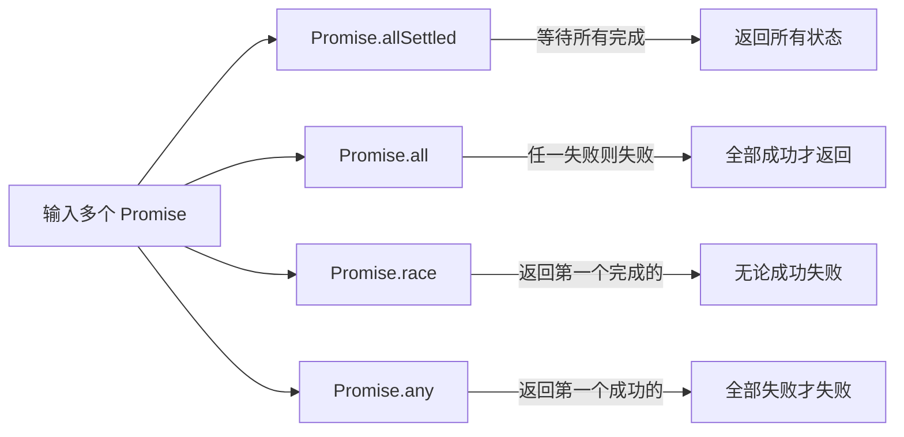

### `Promise`  


### `Promise`组合方法详解：  
`allSettled`、`all`、`race`、`any`  
在`JavaScript`异步编程中，`Promise`提供了多种组合方法用于处理多个`Promise`实例。这些方法在并发控制和结果处理方面各有特点。   
| 方法                   | 行为特点                              | 成功条件                  | 失败条件                  | 返回值                                  |
| ---------------------- | ------------------------------------- | ------------------------- | ------------------------- | --------------------------------------- |
| `promise.allSettled()` | 等待所有`Promise`完成(无论成功或失败) | 所有`Promise`都完成       | 永不失败                  | 对象数组，包含每个`Promise`的状态和结果 |
|                        |
| `Promise.all()`        | 等待所有`Promise`成功                 | 所有`Promise`都成功       | 任一`Promise`失败         | 成功值数组                              |
| `Promise.race()`       | 响应第一个完成的`Promise`             | 第一个完成的`promise`成功 | 第一个完成的`Promise`失败 | 第一个完成的`Promise`的结果             |
| `Promise.any()`        | 响应第一个成功的`Promise`             | 任一`Promise`成功`        | 所有`promise`都失败       | 第一个成功的`Promise`的值               |

#### 1.`Promise.allSettled()`  
**作用：**等待所有`Promise`完成（无论成功或失败），返回每个`Promise`的最终状态和结果。  
**特点：**  
    + 永不拒绝(`reject`) 
    + 返回对象数组，每个对象包含：  
        + `status`:"`fullfiled`" 或 "`rejected`"   
        + `value`(当`fullfilled`时)，或`reason`(当`rejected`时)   

```javascript
Promise 1: {status: "fulfilled", value: 1}
Promise 2: {status: "rejected", reason: "Error"}
Promise 3: {status: "fulfilled", value: 3}
```
使用场景：  
+ 需要知道所有异步操作最终结果的情况  
+ 批量处理任务，无论个别任务是否成功  
+ 收集错误信息进行统一处理
#### 2.`Promise.all()`   
**作用**：当所有`Promise`都成功时返回结果数组；如果任一`Promise`失败，则立即拒绝。   
**特点：**  
+ 快速失败机制(任一`Promise`失败即整体失败)  
+ 返回数组中结果的顺序与传入的`Promise`顺序一致  

```javascript
const p1 = Promise.resolve(1);
const p2 = Promise.resolve(2);
const p3 = new Promise((resolve) => setTimeout(() => resolve(3), 100));

// 所有成功
Promise.all([p1, p2, p3])
  .then(values => console.log("成功:", values)) // [1, 2, 3]
  .catch(err => console.log("失败:", err));

// 包含失败
const p4 = Promise.reject("Error");
Promise.all([p1, p4, p3])
  .then(values => console.log("成功:", values))
  .catch(err => console.log("失败:", err)); // "Error"
```  
+ 多个相互依赖的异步操作(如同时获取用户信息和订单信息)  
+ 需要所有数据都成功才能继续执行的场景  
+ 批量创建资源时确保全部成功   

3.`Promise.race()`  
**作用**：返回第一个完成的`Promise`(无论成功或失败)的结果。  
**特点**：  
+ 只关心最先完成的结果  
+ 其他未完成的`Promise`结果会被忽略  
+ 可能返回成功值或错误原因   
**使用场景：**  
+ 实现超时控制  
+ 从多个数据源获得最快响应  
+ 竞速操作(如加载多个资源，使用最先可用的) 
4.`Promise.any()`  
**作用**：返回第一个成功的`Promise`;如果所有`Promise`都失败，则返回一个`AggregateError`。   
**特点**:  
 + 忽略失败，直到找到第一个成功
 + 如果全部失败，返回包含所有错误的`AggregateError`     
**使用场景**：  
+ 从多个备用源获取数据(如`CDN`镜像)  
+ 实现容错机制(尝试多种方法直到一个成功的)   
+ 服务降级(多个方案，使用第一个可用的)  


#### 适用场景比较  
| 方法         | 最佳适用场景                       |
| ------------ | ---------------------------------- |
| `allSettled` | 需要完整报告所有异步操作结果       |
| `all`        | 多个相互依赖的异步操作必须全部成功 |
| `race`       | 需要最快响应或实现超时控制         |
| `any`        | 需要容错机制，任一成功即可         |

#### 实际应用技巧   
1.超时控制（`race+setTimeout`）  
```javascript
function withTimeout(promise,timeout){
  const timeoutPromise = new Promise(_,reject)=>{
    setTimeout(()=> reject(new Error("超时")),timeout))
  }
  return Promise.race[(promise,timeoutPromise)];
}
// 使用示例  
const apiCall = fetch("https://api.example.com/data")  
withTimeout(apiCall,5000).then(data=>console.log(data)).catch(err=>console.error(err));
```  
2.批量处理+错误收集(`allSettled`)  
```javascript
async function batchProcess(tasks){
  const results = await Promise.allSettled(tasks.map(task=>task()));  
  const successes = results.filter(r=>r.status==="fulfilled").map(r=>r.value);  
  const errors = results.filter(r=>r.status==="rejected").map(r=>r.reason);  
  return {successes,errors};
}
const tasks = [saveUser,updateProfile,sendNotification];
batchProcess(tasks).then(({successes,errors})=>{
  console.log(`成功：${successes},失败：${errors}`);
})
```    
```javascript
// 多重回源策略(any)   
async function fetchWithFallback(urls){
  try{
    const response = await Promise.any(urls.map(url=>fetch(url)));
    return response.json();
  }catch(err){
    console.error("所有源均失败",err.errors);
    throw new error("无法获取数据");
  }
}
const mirrors = [
  'https://mirror1.example.com/data',
  'https://mirror2.example.com/data',
  'https://mirror3.example.com/data'
];
fetchWithFallback(mirrors)
.then(data=>{
  console.log(data);
}).catch(err=>{
  console.error(err);
})
```  


