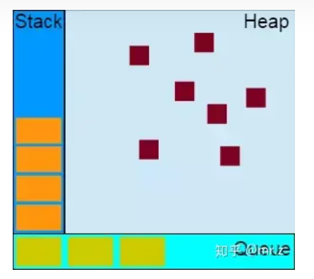

### 事件循环(`Event Loop`)  
> `Event Loop` 即事件循环，是浏览器或`Node`解决`JavaScript`单线程运行时不会阻塞的一种机制,也就是我们经常使用**异步**的原理。

> `JavaScript`是单线程的(指的是`JS`引擎在执行代码的时候只有一个主线程，每次只能干一件事)，同时还是**非阻塞运行**的(执行异步任务的时候，会先挂起相应任务，待异步返回结果再执行回调)，这就要知道其事件的循环机制才能正确理解`js`代码的执行顺序。

### 堆、栈、队列  

#### 堆 (`Heap`)  
**堆**是一种数据结构,是利用完全二叉树维护的一组数据，**堆**分为两种，一种为最大**堆**，一种为**最小堆**，**根节点最大的堆，叫做最大堆或大根堆**，根节点最小的堆叫做**最小堆**或**小根堆**。
#### 
