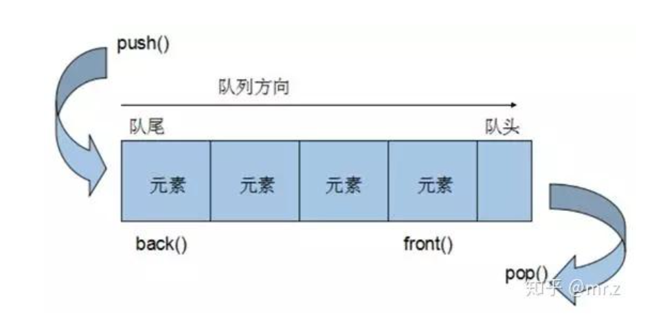

### 事件循环(`Event Loop`)  
[一次弄懂Event Loop](https://zhuanlan.zhihu.com/p/55511602)

> `Event Loop` 即事件循环，是浏览器或`Node`解决`JavaScript`单线程运行时不会阻塞的一种机制,也就是我们经常使用**异步**的原理。

> `JavaScript`是单线程的(指的是`JS`引擎在执行代码的时候只有一个主线程，每次只能干一件事)，同时还是**非阻塞运行**的(执行异步任务的时候，会先挂起相应任务，待异步返回结果再执行回调)，这就要知道其事件的循环机制才能正确理解`js`代码的执行顺序。

### 堆、栈、队列  

#### 堆 (`Heap`)  
**堆**是一种数据结构,是利用完全二叉树维护的一组数据，**堆**分为两种，一种为最大**堆**，一种为**最小堆**，**根节点最大的堆，叫做最大堆或大根堆**，根节点最小的堆叫做**最小堆**或**小根堆**。  
**堆**是**线性**数据结构，相当于**一维数组**，有唯一后继。
#### 栈(Stack)  
**栈**在计算机科学中是限定仅在**表尾**进行**插入**或**删除**操作的线性表。
> **栈**是一种数据结构，它按照**后进先出**的原则存储数据，**先进入**的数据被压入**栈底**，**最后的数据**在**栈顶**，需要读数据的时候从**栈顶**开始**弹出数据**。  
**栈**是只能在**某一端插入**和**删除**的**特殊线性表**。  

> **栈的性质**：后进先出

   

#### 队列(`Queue`)  
特殊之处在于它只允许在表的前端(`front`)进行**删除**操作，而在表的后端(`rear`)进行**插入**操作，和**栈**一样，**队列**是一种操作受限制的线性表。   
进行**插入**操作的端称为**队尾**，进行**删除**操作的端称为**队头**。队列中没有元素时，称为**空队列**。   
**队列**的数据元素又称为**队列元素**，在队列中插入一个队列元素称为**入队**，从**队列**中**删除**一个队列元素称为**出队**。因为队列**只允许**在一端**插入**，在另一端**删除**，所有只有**最早**进入**队列**的元素**才能最先从队列中**删除，故队列又称为**先进先出**(`FIFO-first in first out`)。   

   

### `Event Loop`  
在`JavaScript`中，任务被分为两种，一种**宏任务**(`MacroTask`)也叫`Task`,一种叫**微任务**(`MicroTask`)。   
### `MacroTask`(宏任务)  
+ `script`全部代码、`setTimeout`、`setInterval`、`setImmediate`(浏览器暂时不支持，只有IE10支持，具体可见`MDN`)、I/O、`UI Rendering`。  
### `MicroTask`(微任务)  
+ `Process.nextTick(Node 独有)`、`Promise`、`object.observe(废弃)`、`MutationObserver`;   
### 浏览器中的`Event Loop`  
`JavaScript`有一个`main thread`主线程和`call-stack`调用栈*(执行栈),所有的任务都会被放到调用栈等待主线程执行。   
### `JS`调用栈   
`JS`调用栈采用的是后进先出的规则，当函数执行的时候，会被添加到栈的顶部，当执行栈执行完成后，就会从栈顶移出，直到栈内被清空。   

### 同步任务和异步任务   
`JavaScript`单线程任务被分为**同步任务**和**异步任务(宏任务和微任务)**,同步任务会在调用栈中按照顺序等待主线程依次执行，异步任务会在异步任务有了结果后，将注册的回调函数放入任务队列中等待主线程空闲的时候(调用栈被清空)，被读取到栈内等待主线程的执行。  

> 回调注册阶段是宏任务，但回调执行时微任务。   


  

任务队列(`Task Queue`*) ,即队列,是一种先进先出的一种数据结构。 

  

### 事件循环的进程模型  
+ 选择当前要执行的任务队列，选择任务队列中最先进入的任务，如果任务队列为空即`null`,则执行跳转到微任务(`MicroTask`)的执行步骤。   
+ 将事件循环中的任务设置为已选择任务。  
+ 执行任务。   
+ 将事件循环中当前运行任务设置为`null`。  
+ 将已经运行完成的任务从任务队列中删除。  
+ `microtasks`步骤：进入`microtask`检查点   
+ 更新界面渲染。
+ 返回第一步。  

### 执行进入`microtask`检查点时，用户代理会执行以下步骤：  
+ 设置`microtask`检查点标志为`true`。  
+ 当事件循环`microtask`执行不为空时：
选择一个最先进入的`microtask`队列的`microtask`,将事件循环的`microtask`设置为已选择的`microtask`,运行`microtask`,将已经执行完成的`microtask`为`null`，移出`microtask`中的`microtask`。   
+ 清理`indexDB`事务  
+ 设置进入`microtask`检查点的标志为`false`。   


  

执行栈在执行完**同步任务**后，查看**执行栈**是否为空，如果执行栈为空，就会去执行`Task`(宏任务)，每次**宏任务**执行完毕后，检查**微任务(microTask)**队列是否为空，如果不为空的话，会按照**先入先出**的规则全部执行完**微任务**(microTask)后，设置**微任务**(microTask)队列为`null`,然后再执行**宏任务**,如此循环。   

```javascript
console.log('start');
setTimeout(function(){
    console.log('setTimeout');
},0);
Promise.resolve().then(function(){
    console.log('promise1');
}).then(function(){
    console.log('promise2');
});
console.log('script end');
```   
 

```javascript
console.log('script start')

async function async1() {
  await async2()
  console.log('async1 end')
}
async function async2() {
  console.log('async2 end') 
}
async1()

setTimeout(function() {
  console.log('setTimeout')
}, 0)

new Promise(resolve => {
  console.log('Promise')
  resolve()
})
  .then(function() {
    console.log('promise1')
  })
  .then(function() {
    console.log('promise2')
  })

console.log('script end')
```  
这里需要先理解`async/await`。  
`async/await`在底层转换成了`promise`和`then`回调函数。  
也就是说`async/await` 是 `promise`的语法糖。   
每次我们使用`await`，解释器都创建一个`promise`对象，然后把剩下的`async`函数中的操作放到`then`回调函数中。  
`async/await`的实现，离不开`Promise`。从字面意思来理解，`async` 是"异步"的缩写，而`await`是`async wait`的简写可以认为是等待异步方法执行完成。   


## `NodeJS`的`Event Loop`  
;  

`Node`中的`Event loop`是基于`libuv`实现的，而`libuv`是`Node`的新跨平台抽象层，`libuv`使用异步，事件驱动的编程方式，核心是提供`i/o`的事件循环和异步回调。`libuv`的`API`包含有时间，非阻塞的网络，异步文件操作，子进程等等。`Event Loop`就是在`libuv`中实现的。   

  

`Node`的`Event loop`一共分为6个阶段，每个细节具体如下：   
+ `timers`：执行`setTimeout`和`setInterval`中到期的`callback`。   
+ `pending callback`：上一轮循环中少数的`callback`会放在这一阶段执行。 
+ `idle,prepare`：仅在内部使用。  
+ `poll`:最重要的阶段，执行`pending callback`,在适当的情况下会阻塞在这个阶段。   
+ `check`:执行`setImmediate`(`setImmediate()`是将事件插入到事件队列尾部，主线程和事件队列的函数执行完成之后立即执行`setImmediate`指定的回调函数)的`callback`。   
+ `close callbacks`:执行`close`事件的`callback`,例如`socket.on('close'[,fn])`或者`http.server.on('close,fn)`。   

具体细节如下：  
`timers`   
执行`setTimeout`和`setInterval`中到期的`callback`,执行这两者回调需要设置一个毫秒数，理论上来说，应该是时间一到就立即执行`callback`回调，但是由于`system`的调度可能会延时，达不到预期时间。      

### `pending callbacks`  
此阶段执行某些系统操作(`例如TCP`错误类型)的回调。例如，如果`TCP socket econnrefused`在尝试`connect`时`receives`,则某些`*nix`系统希望等待报告错误。这将在`pending callbacks`阶段执行。   

### `poll`  
**该`poll`阶段有两个主要功能**：   
+ 执行`I/O`回调。   
+ 处理轮询队列中的事件。   

**当事件循环进入`poll`阶段并且在`timers`中没有可以执行定时器时，将发生以下两种情况之一**  
+ 如果`poll`队列不为空，则事件循环将遍历其同步执行它们的`callback`队列，直到队列为空，或者达到`system-dependent`(系统相关限制了)。
**如果`pull`队列为空，则会发生以下两种情况之一**  
+ 如果有`setImmediate()`回调需要执行，则会立即执行`poll`阶段并进入执行`check`阶段以执行回调。
+ 如果没有`setImmediate()`回调需要执行，`poll`阶段将等待`callback`被添加到队列中，然后立即执行。  

**当然设定了`timer`的话且`poll`队列为空，则会判断是否有`timer`超时，如果有的话会回到`timer`阶段执行回调**  
`check`  
**此阶段允许人员在`poll`阶段完成后立即执行回调。**  
如果`poll`阶段闲置并且`script`已排队`setImmediate()`,则事件循环到达`check`阶段执行而不是继续等待。   

`setImmediate()`实际上是一个特殊的计时器，它在事件循环的一个单独阶段运行。它使用`libuv``API`来调度在`poll`阶段完成后执行的回调。   
通常，当代码被执行时，事件循环最终将达到`poll`阶段，它将等待传入连接，请求等。   
但是，如果已经调度了回调`setImmediate()`，并且轮询阶段变为空闲，则它将结束并且达到`check`阶段，而不是等待`poll`事件。   
```javascript
console.log('start');
setTimeout(()=>{
  console.log('timer1');
  Promise.resolve().then(function(){
    console.log('promise1');
  })
},0);
setTimeout(()=>{
  console.log('timer2');
  Promise.resolve().then(function(){
    console.log('promise2');
  })
},0);
Promise.resolve().then(function(){
  console.log('promise3');
})
console.log('end');
```  
如果`node`版本为`v11.x`， 其结果与浏览器一致。  
```javascript
start
end
promise3
timer1
timer2
promise1
promise2
```  
如果`v10`版本上述结果存在两种情况：   
+ 如果`time2`定时器已经在执行队列中了，那么执行结果与上面结果相同。  
+ 如果`time2`定时器没有在执行队列中，执行结果为：   
```javascript
start
end
promise3
timer1
promise1
timer2
```  
 
;   

### `setImmediate()`和`setTimeout()`的区别  
**`setImmediate()`和`setTimeout()`是相似的，但根据它们被调用的时间以不同的方式表现。**  
+ `setImmediate()`设计用于在当前`poll`阶段完成后`check`阶段执行脚本。   
+ `setTimeout()`安排在经过最小`(ms)`后运行的脚本，在`timers`阶段执行。    

**eg：**  
```javascript
setTimeout(()=>{
  console.log('timeout');
},0);
setImmediate(()=>{
  console.log('immediate');
})
```    
执行定时器的顺序将根据调用它们的上下文而有所不同。如果从主模块中调用两者，那么时间将受到进程性能的限制。   

其结果也不一样   
如果在`I/O`周期内移动两个调用，则始终首先执行立即回调：   
```javascript
const fs = require('fs');   
fs.readFile(_filename,()=>{
  setTimeout(()=>{
    console.log('timeout');
  },0)
  setImmediate(()=>{
    console.log('immediate');
  })
})
```  
其结果确定一定是`immediate`=>`timeout`   
主要原因是在`I/O`阶段读取文件后，事件循环会先进入`poll`阶段，发现有`setImmediate`需要执行，会立即进入`check`阶段执行`setImmediate`的回调。  
然后再进入`timers`阶段，执行`setTimeout`，打印`timeout`。  

;   

### `Process.nextTick()`  
`process.nextTick()`虽然它是异步`API`的一部分，但未在图中显示。这是因为`process.nextTick()`从技术上讲，它不是事件循环的一部分。   
+ `process.nextTick()`方法将`callback`添加到`next tick`队列，一旦当前事件轮询队列的任务全部完成，在`next tick`队列中的所有`callbacks`会被依次调用。  

**换种理解方式：**  
+ 当每个阶段完成后，如果存在`nextTick`队列，就会清空队列中的所有回调函数，并且优先于其他`microtask`执行。  

**eg:**  
```javascript
let bar;
setTimeout(()=>{
  console.log('setTimeout');
},0);
setImmediate(()=>{
  console.log('setImmediate');
})
function someAsyncApiCall(callback){
  process.nextTick(callback);
}
someAsyncApiCall(()=>{
  console.log('bar',bar); //1
})
bar = 1;
```  
在`NodeV10`中上述代码执行可能有两种答案，一种为：  
```javascript
bar 1
setTimeout
setImmediate
```  
另一种为： 
```javascript
bar 1
setImmediate
setTimeout
```  
无论哪种，始终都是先执行`process.nextTick(callback)` ,打印`bar 1`。


