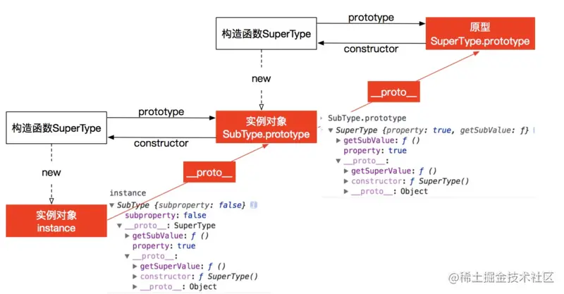

### 一、原型链继承  
构造函数、原型和实例之间的关系：  
+ 每个构造函数都有一个原型对象。
+ 原型对象都包含一个指向构造函数的指针。   
+ 而实例都包含一个原型对象的指针。   

继承的本质就是**复制，即重写原型对象**，代之以一个新类型的实例。   

> 核心，子类的原型等于父类的实例      

### 原型链方案存在的缺点:   
+ 1.子类实例共享了父类构造函数的引用属性，多个实例对引用类型的操作会被篡改   
+ 2.不能向父类构造函数传参

```javascript
function SuperType(){
    this.property = true;
}
SuperType.prototype.getSuperValue = function (){
    return this.property;
}
function SubType(){
    this.subproperty = false;
}
// 这里是关键，创建`SuperType`的实例，并将该实例赋值给`SubType.prototype`
SubType.prototype = new SuperType();  

SubType.prototype.getSubValue = function(){
    return this.subproperty;
}
var instance = new SubType();
console.log(instance.getSuperValue());//true
```


