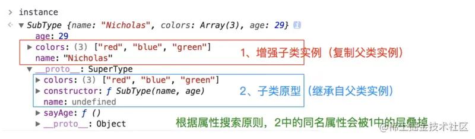

### 组合继承  
组合上述两种方法就是组合继承(原型链继承和借用构造函数继承)。  
用**原型链**实现对**原型**属性和方法的继承  
借用**构造函数技术**来实现**实例**属性的继承。

### 优点  
+ 1.可以向父类构造函数传递参数  
+ 2.可以重用父类原型上的方法  
+ 3.不共享父类的引用属性  
### 缺点 
调用了两次父类的构造方法，会存在一份多余的父类实例属性。  
+ 第一次调用`SuperType()`:给`SubType.prototype`写入两个属性`name`、`color`。   
+ 第二次调用`SuperType()`:给`instance1`写入两个属性`name`、`color`。   
实例对象`instance1`上的两个属性就屏蔽了其原型对象`SubType.prototype`的两个同名属性。所以，组合模式的缺点就是在使用子类创建实例对象时，其原型中会存在两份相同的属性和方法。  


```javascript
function SuperType(name){
    this.name = name;
    this.colors = ["red","blue","green"];
}
SuperType.prototype.sayName = function(){
    alert(this.name);
}
function subType(name,age){
    // 继承属性
    // 第二次调用SuperType()  
    SuperType.call(this,name);
    this.age = age;
}
// 继承方法  
// 构建原型链   
// 第一次调用`SuperType()`  
SubType.prototype = new SuperType();  
// 重写SubType.prototype的constructor属性，指向自己的构造函数SubType  
SubType.prototype.constructor = SubType;   
SubType.prototype.sayAge = function(){
    alert(this.age);
}
var instance1 = new SubType("Nicholas"，29);
instance1.colors.push("black");
alert(instance1.colors); // "red,blue,green,black"  
instance1.sayName(); // "Nicholas"
instance1.sayAge(); // 29

var instance2 = new SubType("greg",27);  
alert(instance2.colors); // "red,blue,green"  
instance2.sayName(); // "Greg"  
instance2.sayAge(); // 27
```    

   


