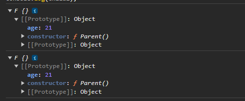

### 原型式继承   
利用一个空对象作为中介，将某个对象直接赋值给空对象构造函数的原型。  

[参考链接](https://blog.csdn.net/weixin_44194732/article/details/106585715)
```javascript
function object(obj){
    function F(){}  
    F.prototype = obj;  
    return new F();    
}
```  
`object()`对传入其中的对象执行了一次`浅复制`
```javascript
var person = {
    name:"Nicholas",
    friends:["Shelby","Court","Van"]
};  
var anotherPerson = object(person);
anotherPerson.name = "Greg";
anotherPerson.friends.push("Rob");   

var yetAnotherPerson = object(person);  
yetAnotherPerson.name = "Linda";  
yetAnotherPerson.friends.push("Barbie");   
alert(person.friends); // "Shelby,Court,van,Rob,Barbie"
```   
### 缺点   
+ 原型链继承多实例的引用类型属性指向相同，存在篡改的可能。
+ 无法传递参数  

另外，`ES5`中存在`Object.create()`的方法，能够代替上面的`object`方法。   


### 拓展  
在`ES6`之前没有`Object.create()`方法，所以才会有开头那段伪代码。   
```javascript
function object(obj){
    function F(){}  
    F.prototype = obj;
    return new F();
}
```  
### 自己实现一个`Object.create()`  
1.思考`Object.create()`作用：  
+ 接受一个对象`A`  
+ 返回一个对象`B`  
+ 并且`B._proto_`-----> `A`    

```javascript
function object(obj){
    function F() {};
    F.prototype = obj;  
    return new F();
}  
const cat = {
  heart: '❤️',
  colors: ['white', 'black']
}
const guaiguai = object(cat)
const huaihuai = object(cat)

console.log(guaiguai)
console.log(huaihuai)

console.log(guaiguai.heart)
console.log(huaihuai.colors)
```  
效果是和`Object.create()`差不多(只不过我们自定义的`object`返回的对象是构造函数`F`创建的)。

这就有小伙伴要问了，既然是需要满足
> `B._proto_ ---> A`   

这个条件的话，我这样写也可以实现啊   
```javascript
function object(obj){
    const newObj = {};
    newObj._proto_ = obj;
    return newObj;
}
```
不过，我们是要模拟Object.create()方法;  

> 无法向父类构造函数传参，并且父类构造函数中的属性无法继承，只能继承父类构造函数中的原型对象中的属性，**要想继承父类构造函数中的属性，还得借用`Parent.call()`。**  

```javascript
function Parent(){
    this.name = 'a';
    this.colors = ['red','yellow'];  
}  

Parent.prototype.age = 21;  
function object(obj){
    function F(){
        // Parent.call(this)
    };
    F.prototype = obj;  
    return new F();
}
const child1 = object(Parent.prototype);
const child2 = object(Parent.prototype);  
console.log(child1);
console.log(child2);     
```




