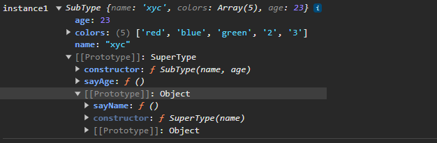

### 寄生组合式继承  
> 结合借用构造函数传递参数和寄生模式实现继承   

```javascript  
function inheritPrototype(subType,superType){
    // todo   
    var prototype = Object.create(superType.prototype);  // 创建对象，创建父类原型的一个副本  
    prototype.constructor = subType; // 增强对象，弥补因重写原型而失去的默认`constructor`属性   
    subType.prototype = prototype; // 指定对象，将创建的对象赋值给子类的原型     
}
// 父类初始化实例属性和原型属性  
function SuperType(name){
    this.name = name;
    this.colors = ["red","blue","green"];  
}
SuperType.prototype.sayName = function(){
    alert(this.name);
}
// 借用构造函数传递增强子类实例属性(支持传参和避免篡改)  
function SubType(name,age){
    SuperType.call(this,name);
    this.age = age;
}
// 将父类原型指向子类实例  
inheritPrototype(SubType,SuperType);
// 新增子类原型属性  
SubType.prototype.sayAge = function(){
    alert(this.age);
}
var instance1 = new SubType("xyc",23);
var instance2 = new SubType("lxy",23);  
instance1.colors.push("2"); //["red","blue","green","2"]
instance2.colors.push("3"); //["red","blue","green","3"]
```
  

这个例子的高效率体现在它只调用一次`SuperType`构造函数，因此避免了在`SubType.prototype`上创建不必要的、多余的属性。与此同时，原型链还能保持不变；因此，还能够正常使用`instanceof`和`isPrototypeOf()`。  

这是成熟的方法，也是现在库实现的方法。  


