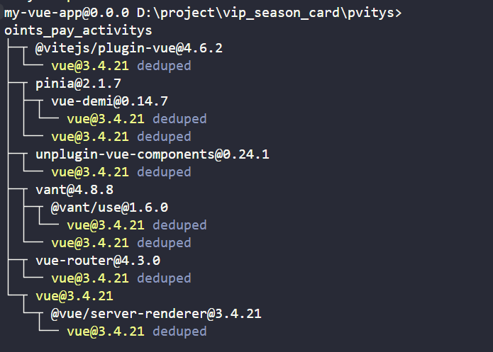
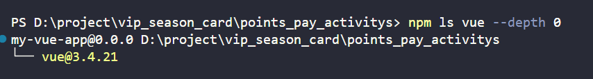

[深入了解Npm](https://zhuanlan.zhihu.com/p/362828765)   

> **npm(Node Package Manager)**是`JavaScript`世界的包管理器，用于`Node.js`环境中管理依赖项。以下是关于`npm`的一些关键信息和常见操作：   

### 关键特性  
1.包管理：`npm`允许开发者发布、发现、安装和管理`Node.js`应用程序的依赖库(称为`"packages"`或`"modules"`)。这些依赖库通常托管在`npm`官方注册表——`npm Registry`(https://www.npmjs.com/)上 。  
2.**版本控制**：`npm`支持语义化版本控制(`Semantic Versioning,SemVer`)，确保开发者可以准确地指定和获取依赖库的特定版本，避免因依赖更新导致的不兼容问题。   
3.**本地与全局安装**:`npm`可以将依赖项安装到项目本地(`node_modules`目录下)，仅对该项目生效；也可以全局安装，使得命令行工具在整个系统范围内可用。
4.`package.json`和`package-lock.json`:   
 + `package.json`文件记录了项目的元数据(如项目名称、版本、作者等)以及依赖关系。它定义了项目所需的直接依赖(`dependencies`)、开发时依赖(`devDependencies`)、可选依赖(`optionalDependencies`)等。  
 + `package-lock.json`文件记录了依赖树的具体版本和下载地址，确保在不同环境中构建时能复现一致的依赖版本。   
 + **脚本执行**：`npm`提供了一个便捷的方式来运行项目中的脚本，通过在`package.json`中定义`scripts`字段。例如常见的`npm start`、`npm test`、`npm run build`等。   
### 常见命令  
#### 初始化项目  
bash
***  
`npm init`  

这将引导您创建一个新的`package.json`文件，用于记录项目信息和依赖项。   

##### **安装依赖**  
+ **本地安装(默认)**:将依赖项添加到`dependencies`或`devDependencies`，并安装到`node_modules`。  

bash  
*** 
```javascript
npm install <package-name>  
# 或简写为  
npm i <package-name>  
# 保存为开发依赖  
npm install --save-dev <package-dev>  
# 或简写为   
npm i -D <package-name>
```    
+ **全局安装**：  
bash
***  
```javascript
npm install -g <package-name>
```  
#### 更新依赖  
+ 更新单个依赖至最新版本(符合`package.json`中的版本范围)：  
  
bash
***  
```javascript
npm update <package-name>
```  
+ 更新所有依赖至最新版本：  

bash  
***  
```javascript
npm update  
```  

#### 卸载依赖  
+ 卸载本地依赖并从`package.json`中移除：  

bash  
*** 
```javascript
npm uninstall <package-name>
# 或简写为  
npm rm <package-name>
```  
+ 卸载全局依赖：
bash   
***    
```javascript
npm uninstall -g <package-name>
```  
#### 查看依赖  
+ 列出已安装的所有依赖：  

bash  
***  
```javascript
npm list  
# 或简写为  
npm ls
```   
+ 查看某个依赖的详细信息：  

bash   
***   
```javascript
npm view <package-name>
```  
#### 其他常用命令   
+ 清理缓存：  

bash  
***  
```javascript
npm cache clean --force
```  
+ 检查依赖树：  
  
bash  
***  
```javascript
npm ls --depth=0
```     
+ 运行项目脚本：  
     
bash  
***  
```javascript
npm run <script-name>
```  


## `npm`
1.`npm(npm package manager)`:`node.js`的包管理器，用于`node`插件管理(包括安装、卸载、管理依赖等)，`npm`是随同`node.js`一起安装的包管理工具，能解决`node.js`代码部署上的很多问题，常见的使用场景有以下几种：  
+ 允许用户从`npm`服务器下载别人编写的第三方包到本地使用。  
+ 允许用户从`npm`服务器下载别人编写的命令行程序到本地使用。  
+ 允许用户自己编写的包或命令行程序上传到`npm`服务器，供别人使用。  
 
（1） `npm` 是一个包管理器，它让`javascript`开发者分享、复用代码更方便。在程序开发中我们常常需要依赖别人提供的框架，写`js`也不例外。这些可以重复的框架代码被称作包(`package`)或者模块(`module`)，一个包可以是一个文件夹里放着几个文件，同时有一个叫做`package.json`的文件，里面包含了一些关于这个包的信息。   
（2）一个网站里通常有几十甚至上百个`package`,分散在各处，通常会将这些包按照各自的功能进行划分(类似安卓开发中的划分子模块)，但是如果重复造一些轮子，不如上传到一个**公共平台**，让更多的人一起使用、参与这个特定功能的模块。而`npm`的作用就是让我们发布、下载一些`JS`轮子更加方便。   

[npmjs.com官网](https://www.npmjs.com/)  

2.安装`npm`  
(1)安装`node.js`的时候会相应的安装`npm`,`node.js`已经集成了`npm`,所以安装了`node.js`后`npm`也安装好了。  

3.更新`npm`  
`npm`更新地可比`node`快多了，因此你下载的`node`附带的`npm`版本可能不是最新的，你可以使用如下命令下载最新`npm`:  
```javascript
npm install npm@latest -g  相当于`npm install xxx@最新版 -全局`
```  
这里`@`后面表示版本号
或  
```javascript
npm install -g npm
```    
4.`package.json`文件介绍  
+ `npm`的全称:`Node Package Manager`,中文意思：`node`包管理器。  
+ 管理本地安装`npm`包的最好方式就是创建`package.json`文件。一个`package.json`文件可以有以下几点作用：  
+ 1.作为一个描述文件，描述了你的项目依赖哪些包  
+ 2.允许使用 "语义化版本规则"指明你项目依赖包的版本。  
+ 3.让你的构建更好地与其他开发者分享，便于重复使用。  

5.`package.json`如何创建   
使用`npm init`即可在当前目录下创建一个`package.json`文件：   

+ 输入`npm init`后会弹出一堆问题，可以输入对应内容，也可以使用默认值。在回答一堆问题后输入`yes` 就会生成图中所示内容的 `package.json`文件。  
+ 如果嫌回答这一大堆问题麻烦，可以直接输入npm init --yes 跳过回答问题步骤，直接生成默认值的 package.json 文件:  

6.`package.json`的内容   
+ `package.json` 文件至少要有两部分内容：   
+ 1.`"name"`：全部小写，没有空格，可以使用下划线或者横线。   
+ 2.`"version`：x.x.x的格式，符合"语义化版本规则"。   
+ 如：   
```javascript  
"name": "demo-package","version": "1.0.0"
```  
7.`dependencies(生产环境)`和`devDependencies(开发环境)`的区别   
+ 就是在项目开发阶段就是开发环境；项目上线了，开始正式提供对外服务，**上线后的阶段就是生产环境**。在生产环境下，一般会关掉错误报告，打开错误日志等操作。   
+ `devDependencies`配置的是开发环境，安装项目开发时所依赖的模块。比如像`webpack`工具，只是用来构建项目和打包，这些都是在开发阶段才使用的，等项目上线后就用不到`webpack`工具了，那么就可以把`webpack`安装到开发环境中，使用`--save-dev`命令安装到`devdependencies`下,命令语法：  
```javascript
npm install --save-dev packageName #简写 npm i -D packageName
```  
`dependencies`配置的是生产环境，安装项目运行时所依赖的模块。比如`jQuery`库，等项目上线以后依然是要继续使用的，我们就要安装在生产环境中，如果没有把所需要的依赖安装到生产环境中，项目上线运行时就可能会有报错。使用`--save`命令安装到`dependencies`下，命令语法：  
```javascript
npm install --save packageName 
```
简写形式  
```javascript
npm i -S packageName
```   
## 总结   
配置项|**dependencies**|**devDependencies**  
---|---|---
dependencies|`--save`简写`-S`|生产环境,管理的依赖包在项目上线后依然有效  
devDependencies|`--save-dev` 简写 `-D`|开发环境，管理的依赖包仅在开发阶段有效   

1.使用`npm`安装依赖时，`-save`和`-save-dev`的区别：  
+ 使用`-save`安装的依赖，会被写到`dependencies`区块里面去。  
+ 使用`-save-dev`安装的依赖，则会被写到`devDependencies`区块里面去去。  
+ 什么都不写，只是本地安装，并非全局。这时候会被写到`dependencies`区块里面去。  
1.在`package.json`文件中`dependencies`和`devdependencies`的区别

+ `devdependencies`里面的依赖只用于开发环境，不用于生产环境。而`dependencies`依赖的包不仅开发环境能使用，生产环境也能使用。   
+ 两种环境的指定方式是用过配置文件中的`NODE_ENV=development`或`NODE_ENV=production`来指定是开发环境还是生产环境的。   
+ 使用的一些构建工具例如:`gulp`和`webpack`这些只是在开发中使用的包，上线以后就和他们没关系了，所以将它写入`devDependencies`。   

## 拓展   
查看当前项目中某个包的版本，可以使用以下命令：  

bash   
***  
```javascript
npm ls <package-name>
```  

这里`<package-name>`是您想要查询版本的包的名称。这条命令将**显示项目中安装的指定包及其所有依赖关系，并在输出中包含该包的当前版本信息。**  

例如，如果想查看项目中`vue`包的版本，执行：  

bash  
***  
```javascript
npm ls vue
```  
输出结果中会显示`vue`包及其路径，版本号通常列在其后，形如:  
bash   
***   
    

其中最后一行`vue@3.4.21`就是`vue`包在当前项目中的版本。   

> 这里,会发现，会把包的所有依赖也显示出阿里啊，加上层级控制显示深度：`--depth 0`

   

这样就只会查到安装的包，并不会查到包的依赖。  

如果要查看全局安装的某个包的版本,添加`-g`参数：  

bash  
***  
```javascript
npm ls -g <package-name>
```    
例如：  
bash   
***  
```javascript
npm ls -g vue
```  
这将列出全局安装的`vue`包及其版本。  

> 同样可以添加`--depth 0`   

另外，如果您只是想快速查看某个包的最新可用版本(而非项目中已安装的版本),可以使用`npm view`命令配合`version`属性：  

bash   
***  
```javascript
npm view <package-name> version   
```    
例如：  

bash  
***  
```javascript
    npm view vue version
```  
这将直接输出`vue`包在`npm`注册表中的最新版本号。如果关心的是本地已安装版本与最新版本之间的差异，这个命令会很有帮助。  

### 查看该包的所有版本及最先版本  
```javascript
npm info jquery
```  
### 查看`npmjs`服务器上包的版本信息   
+ 使用`npm view jquery versions`;这种方式可以查看`npm`服务器上所有的`jquery`版本信息；或添加`--json`参数查看json格式的版本信息；  
+ 使用`npm view jquery version`;这种方式只能查看`jquery`的最新版本是哪一个；  
+ 使用`npm info jquery`;这种方式和第一种类似，也可以查看`jquery`所有的版本，但是能查出更多的关于`jquery`的信息；   
### 查看本地已经安装的包的版本信息   
```javascript
npm ls jquery (查看某个项目下的包)  
npm ls jquery -g (查看全局安装的`jquery`)
```


