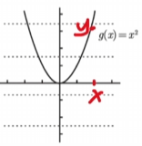
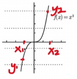
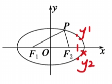

## 什么是副作用`side effect` ？  
+ 与药物的副作用类似  
>纯函数  

> 纯函数`pure function`,指的是给一个函数同样的参数，那么这个函数永远返回同样的值。
+ 函数式编程理念  
+ `React`组件输入相同的参数(`props`),渲染出的`UI`应该永远一样。

+ 副作用与纯函数相反，指一个函数处理了与返回值无关的事情。   

### 从数学的角度  
+ 函数写作：y=f(x)  
+ 函数的定义是指在两个非空集合之后，存在一种关系可以使输入值集合中的每项元素皆能对应唯一一项输出值集合中的元素  

+ 二元一次，一个x只能有一个y与之对应  

+ 三元一次，一个x只能有一个y与之对应  

    

+ 圆、椭圆这样的曲线则不是函数，因为一个x可能有多于一个y与之对应。

> 输入情况一样，而输出结果不确定的情况就是副作用。

    
