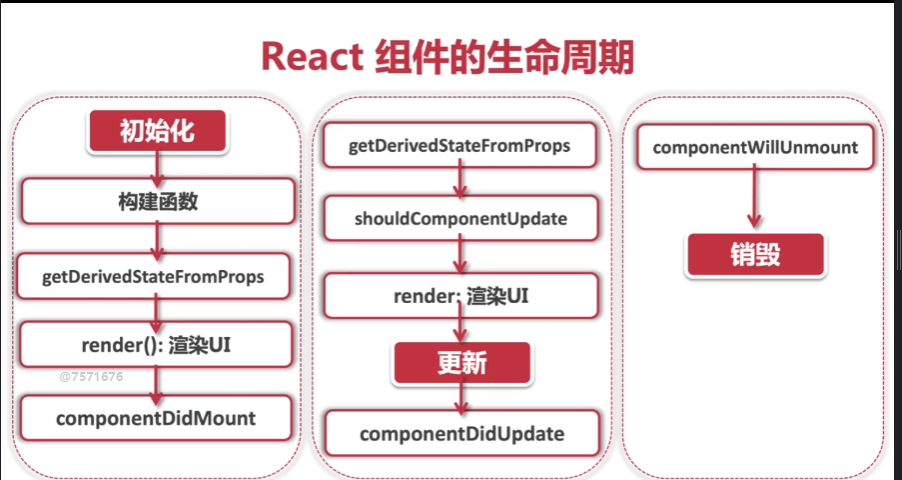

### `React`组件的生命周期   
`React`的生命周期，由生到死，分为三个阶段。

>第一阶段：组件第一次绘制，将会创建虚拟`DOM`元素，渲染`UI`。在这里完成了组件的加载和初始化。

+ `Mounting`:创建虚拟`DOM`,渲染`UI`。  

>第二阶段：是组件在运行和交互的阶段。在这里可以处理用户的交互,收集监听事件，更新`DOM`元素，重新渲染`UI`。

+ `Updating`:更新虚拟`DOM`,重新渲染`UI`。   

>第三阶段，`Unmounting`是组件卸载和消亡的阶段。对组件进行清理。  

+ `Unmounting`:删除虚拟`DOM`,移除`UI`。   

<!-- 生命周期第一阶段：初始化 -->
(1) 初始化组件 `state`  
```javascript
constructor(props){
    super(props);
    this.state = {};
}
```  
(2) `componentDidMount()`
在组件创建好`dom`元素以后，挂载进页面的时候调用，只会在组件初始化的时候，被调用一次。     
<!-- 生命周期第二阶段：更新阶段 -->
(1) `componentWillReceiveProps()`   
当组件的`props`发生改变的时候，函数就会被调用。但是这个函数将会产生无法预测的副作用，有时候会产生一些匪夷所思的事情。这个生命周期函数已经被废止了。替代函数 `getDerivedStateFromProps()`。

> `derived`,意为"衍生的"或"派生的"。   

`static getDerivedStateFromProps(nextProps,prevState){}` 在组件初始化,以及组件更新的时候都会被调用，作用就是用来对比当前的`props`和之前`state`的变化。   

（2）`shouldComponentUpdate(nextProps,nextState)`这个函数的作用是通过判断`props`和`state`的变化，来控制组件是否需要被更新。  
> 一般来说，如果我们不使用这个函数，只要`props`和`state`有任何变化，组件就会马上被更新,`UI`也会重新渲染。但每次渲染`UI`都会带来很大的资源开销。所以有时候我们需要这个函数来判断什么时候去更新组件   

当 `shouldComponentUpdate(nextProps,nextState)` 函数返回`true`时，去更新，返回`false`,不更新。
  
（3）`componentDidUpdate()`只要组件发生了更新，`UI`重新渲染，那么这个函数就会被调用。也就是说，它会在组件更新后被调用。  

<!-- 生命周期第三阶段:销毁 -->
(1) `componentWillUnmount()`   
组件销毁后调用, 可以当作析构函数，`destructor`来使用。通过这个函数可以来回收各种监听以及事件，用来避免组件销毁时可能存在的内存泄漏。    

#### 常见的生命周期   
;  

