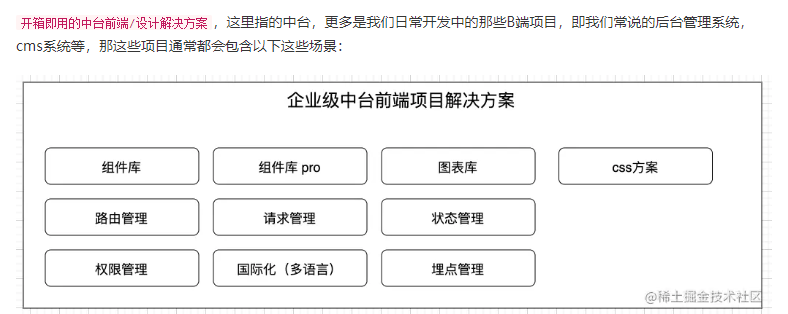

### `ant-design-pro`  
[`ant-design-pro`](https://procomponents.ant.design/)    
    
[前端中台解决方案 之 umijs + ant-design-pro](https://juejin.cn/post/7231818152816443448)  

  

[umijs](https://umijs.org/)   

`Umi.js` 是一个由**蚂蚁集团**开发的企业级前端应用框架，基于`React`生态构建，旨在提供**开箱即用、高度可配置**的解决方案。它通过约定优于配置的理念，简化了前端项目的搭建和开发流程，尤其适合中后台管理系统等复杂应用场景。   

#### 核心特点   
1.开箱即用   
+ 内置路由、构建、部署、测试等工具链，无需额外配置即可快速启动项目。
+ 支持 `TypeScript、CSS Modules`代码分割等现代前端特性。  
2.插件化架构  
+ 提供丰富的官方插件(如数据流管理、权限控制、国际化等)，也支持自定义插件扩展功能。  
+ 典型插件：`@umijs/plugin-dva`(集成`Dva`状态管理)、`@umijs/plugin-locale` (国际化)。  
3.约定式路由  
+ 根据文件目录自动生成路由配置(类似`Next.js`),减少手动维护路由的繁琐操作。  
+ 示例：`src/pages/user/index.tsx`会自动映射为`/user`路由。   
4.高性能构建   
+ 基于`Webpack5` 和 `esbuild`,优化构建速度与产物体积。  
+ 支持按需加载(`Dynamic Import`)、预渲染(`SSR`)等优化手段。   
5.多场景配置  
+ 支持`SPA`(单页应用)、`MPA`多页应用、微前端、`SSR`(微服务渲染)等多种开发模式。   

