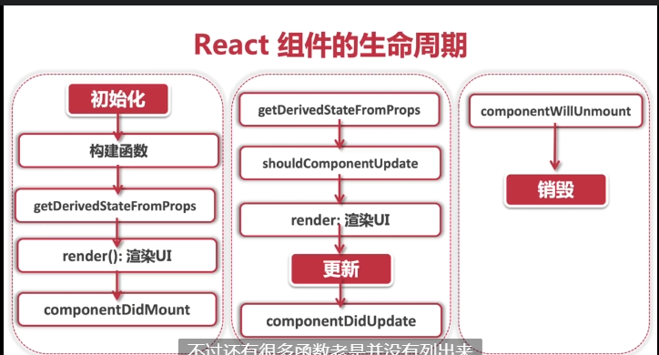

### `React`组件的生命周期
`React`组件生命周期的概念是为了类组件设计的。  

+ `Mounting`：创建虚拟`DOM`,渲染`UI`。  
+ `Updating`：更新虚拟`DOM`，重新渲染`UI`。  
+ `Unmounting`：删除虚拟`DOM`，移除`UI`。  

 #### * 生命周期第一阶段：初始化
 > 初始化组件 `state`
  `constructor(props) {
    super(props);
    this.state = {
      robotGallery: [],
      count: 0,
    };
  }`  

> 在组件创建好`dom`元素以后，挂载进页面的时候调用
`componentDidMount() {}`  

#### * 生命周期第二阶段：更新  
+ 在组件接收到一个新的 prop (更新后)时被调用
 `componentWillReceiveProps() {}`
+  在组件初始化和组件更新时都会被调用，作用就是用来对比当前的`prop` 和之前的`state`的变化
`state getDerivedStateFromProps(nextProps,prevState){}`
+ 通过判断 `props` 和 `state` 的变化 来控制组件是否需要被更新
`shouldComponentUpdate(nextProps, nextState) {
    return nextState.some !== this.state.some;
}`
组件更新后调用，只要组件发生了更新 `UI` 重新渲染，这个函数就会被调用
`componentDidUpdate() {}`
#### * 生命周期第三阶段：销毁
 组件销毁后调用，
 可以当作析构函数 `destructor` 来使用
`componentWillUnmount() {}`

