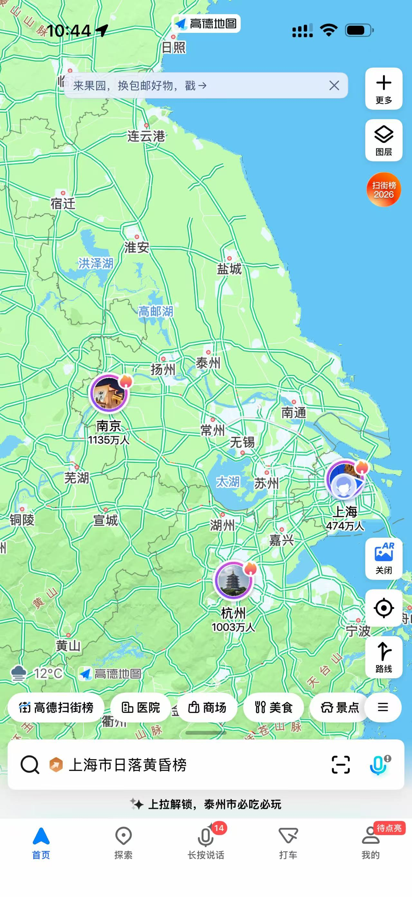

### Travel   

## 第一站：上海
**路线通行度**：景点之间可通过地铁、公交便捷通行。

### 景点与活动详情
| 景点/活动                        | 预约时间/购票建议              | 票价（仅供参考）                                         | 备注                                          |
| -------------------------------- | ------------------------------ | -------------------------------------------------------- | --------------------------------------------- |
| 南京路步行街、城隍庙、豫园       | 无需预约                       | 免费（豫园门票需另购，约30-40元）                        | 建议上午游览，步行即可串联。                  |
| 外滩                             | 无需预约                       | 免费                                                     | 下午至晚间游览，夜景尤佳。                    |
| 黄浦江轮渡（金陵东路渡口）       | 无需预约，注意运营时间         | 2元/人                                                   | 下午最晚通行时间约最晚18:00，过江可至陆家嘴。 |
| 东方明珠塔                       | 提前一天在美团等平台购票可优惠 | 亲子票（1大1小）约280元；老年票有折扣（需现场出示证件）  | 有两球、三球等票种可选，建议提前购票。        |
| 黄浦江夜间观光游轮（十六铺码头） | 可现场购票                     | 约110元/人；儿童免票（需要去售票窗口咨询）；70岁老人半价 | 晚上9点前运营，在十六铺码头售票窗口购票。     |

| 主题公园可选 | 预约时间/购票建议  | 票价（仅供参考）                            | 备注                       |
| ------------ | ------------------ | ------------------------------------------- | -------------------------- |
| 海昌海洋公园 | 提前一天在美团购票 | 儿童票约124元；成人票约224元；老年票约225元 | 需游玩一整天，早上就要出发 |
| 迪士尼乐园   | 提前一天在美团购票 | 亲子票（1大1小）约1000元；老年票约350元     | 需游玩一整天，早上就要出发 |

## 第二站：苏州
**路线通行度**：景点间可乘坐公交、地铁或出租车；山塘街至寒山寺可坐船游览；

### 行程安排
- **第一天**：狮子林→平江路（午餐）→寒山寺→山塘街（夜景）
  1. **狮子林**：需购票（门票30元，老人小孩半价），建议上午游览。
  2. **平江路历史街区**：免费，考虑在这吃午餐。
  3. **寒山寺**：门票约20元。
  4. **山塘街**：夜景，可坐船游览。
- **住宿**：宿在苏州。
- **第二天**：
  1. **虎丘**：门票60元，老人小孩半价，上午游览。
  2. **留园**：可选，离虎丘不远。
  3. **金鸡湖**：免费游览，可在这看日落，可参观东方之门。
  4. 前往高铁站（苏州站或苏州北站）乘高铁至杭州（车程约1.5小时）。

## 第三站：杭州
**路线通行度**：西湖周边可步行、骑行或乘公交；灵隐寺区域建议打车或公交；使用“杭州公共交通码”乘车。

### 景点与预约信息
| 景点             | 预约时间/购票建议                                        | 票价                                       | 备注                           |
| ---------------- | -------------------------------------------------------- | ------------------------------------------ | ------------------------------ |
| 西湖（三潭映月） | 船票提前在美团购买                                       | 船票约55元（含登岛）                       | 西湖免费，三潭映月需乘船上岛。 |
| 雷峰塔           | 可现场购票或提前在线购票                                 | 门票约40元                                 | 建议下午游览，俯瞰西湖全景。   |
| 飞来峰-灵隐寺    | **提前几天在“灵隐寺飞来峰”小程序预约**（可同时预约多人） | 灵隐寺香花券约30元，中午可以看看那里的素斋 | 灵隐寺在飞来峰景区内           |

### 行程安排
- **第一天**：西湖沿线（断桥-白堤-孤山）→乘船至三潭印月→雷峰塔（看日落）→晚餐后可看《印象西湖》演出或河坊街。
- **第二天**：游览飞来峰、灵隐寺（务必提前预约）。
- **住宿**：晚上可宿杭州（建议西湖附近）或直接前往南京（高铁约1.5小时）。

## 第四站：南京
**路线通行度**：景点间可乘地铁或公交；中山陵、博物院等需预约。

### 景点与预约信息
| 景点                     | 预约时间/购票建议                                                                | 票价                                  | 备注                            |
| ------------------------ | -------------------------------------------------------------------------------- | ------------------------------------- | ------------------------------- |
| 南京博物院               | **提前一周在官方小程序预约**                                                     | 免费                                  | 周一闭馆，务必提前预约。        |
| 总统府                   | 提前一天在线购票                                                                 | 门票约35元                            | 可现场购票，但旺季需排队。      |
| 夫子庙-秦淮河风光带      | 夜游船票，可以提前看看美团上又没有，或者现场购买                                 | 街区免费；夜游秦淮河船票约80-100元/人 | 晚上夜游秦淮河，坐船体验佳。    |
| 中山陵（明孝陵可选）     | **需提前预约**（通过“中山陵”小程序或官网）  中山陵周一闭馆，需准时按预约时段进入 | 免费                                  | 周一闭馆，建议上午参观。        |
| 南京大屠杀遇难同胞纪念馆 | **需提前预约**（通过官方小程序） **提前一周在官方小程序预约**                    | 免费                                  | 周一闭馆，建议预留2-3小时参观。 |
| 玄武湖                   | 无需预约                                                                         | 免费                                  | 公园较大，可步行或乘观光车。    |

### 行程安排
- **第一天**：南京博物院，总统府，夫子庙-秦淮河（夜游）。
- **第二天**：中山陵，侵华日军南京大屠杀遇难同胞纪念馆，玄武湖
- **返程**：晚上从南京乘高铁返回上海（车程约1-2小时）。

