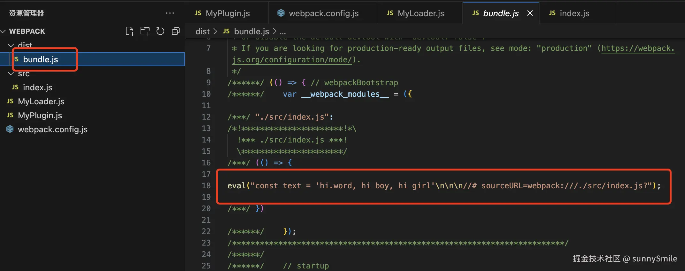

### webpack
**定义**:JavaScript应用程序的静态模块打包器

**作用**:把开发的模块合成一个或指定的几个文件


#### `Webpack Loader`
`Webpack Loader`是`Webpack`的一个重要概念，用于处理模块的转换和编译。  

**主要特点**  

1.**模块化处理**:`Loader`可以处理不同类型的文件，包括`JavaScript`、`CSS`、`HTML`、图片等各种样式的文件。它们将这些文件分别转换为`Webpack`可以理解的模块。   
2.**链式调用**:多个`Loader`可以链式调用。它们按照配置顺序依次对文件进行处理，前一个`Loader`的输出作为下一个`Loader`的输入，这样可以逐步对文件进行不同层次的转换。   
3.**灵活性和可定制性**:开发者可以编写自定义`Loader`来实现特定功能，比如压缩图像、编译现代`JavaScript`、处理样式预处理器(如`SASS`、`LESS`)等。   
4.**无状态函数**:`Loaders`通常是无状态的纯函数，输入是文件内容，输出是转换后的结果。   

5.**基于`Node.js`**:`Loaders`是基于`Node.js`的，因此可以使用任何`Node.js`可以使用的模块和工具进行文件处理。   

6.**复杂处理**:除了简单的文本转换，`Loader`还可以执行复杂的操作，比如将`TypeScript`转换成`JavaScript`、将`SASS`转换成`CSS`,将`ES6+`转换成`ES5`等。   
7.**异步与同步支持**:`Loader`默认是同步的，但开发者可以通过特定的函数调用(如`this.async()`)来实现异步处理。   
8.**资源处理**:`Loader`可以通过`require()`导入其他模块或资源进行处理，因此它们能够动态地加载和处理模块依赖。   

下面是一个基本的`Webpack Loader`的例子，假设我们要创建一个将文件中的`hello`转换为`hi`:
1.首先，创建一个新目录，然后在其中创建一个名为`MyLoader.js`的文件。   
```javascript
module.exports = function(source){
    // 处理源代码  
    const result = source.replace(/hello/g,'hi');
    return result;
}
```  
2.要使用这个`Loader`,在`Webpack`配置文件(`webpack.config.js`)中进行如下配置：  
```javascript
const path = require('path');   
module.exports={
    entry:'./src/index.js',
    output:{
        filename:'bundle.js',  
        path:path.resolve(__dirname,'dist'),
    },
    mode:'development',//设置为开发模式
    module:{
        rules:[
            {
                test:/\.js$/,
                use:path.resolve(__dirname,'MyLoader.js') // 使用自定义Loader
            }
        ]
    }
}
```  
3.运行`Webpack`编译后，所有通过这个`Loader`处理的`.js`文件中的`hello`转化为`hi`。以下面的`js`文件为例:   
```javascript
const text = 'hello.word, hello boy, hello girl';
```  
运行命令：`npx webpack`  
执行结果：   

  

