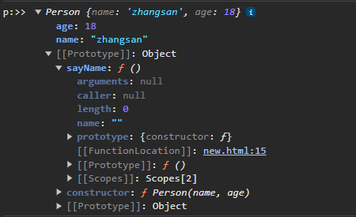

### 函数实现`new`的功能   
要实现一个类似`new`操作符的函数首先我们来分析一下`new`关键字都干了些什么
demo
```javascript
function Person(name,age){
    this.name = name;
    this.age = age;
}
Person.prototype.sayName = function(){
    console.log(this.name);
}
let p = new Person('zhangsan',18);
console.log('p>>',p)
```  


可以看到，当构造函数的执行结果没有返回值(返回`undefined`)时，`new`关键字干的事情可以总结为以下几点：  
+ 1.以构造函数的原型为原型创建一个新的实例  
+ 2.把构造函数身上的属性和方法添加到新的实例身上
+ 3.返回创建的新实例   

这是构造函数没有返回值的例子，其实返回值为非`Object`类型时都是这样的。   
eg:接下来我们再来看下当返回值为对象类型时会发生什么：  
```javascript
function Person(name,age){
    this.name = name;
    this.age = age;  
    return {
        height:181
    }
}
Person.prototype.sayName = function(){
    console.log(this.name);
}
let p = new Person('zhangsan',18);
console.log('p:>>',p);
// 打印结果如下  
p:>> { height:181 }  
```  
我们可以看到当构造函数的返回结果为一个对象时，经`new`关键字返回的仍是这个对象   

经过上面的总结，我们就做出了下面的简单实现  
```javascript
function _new(obj,...args){
    // 1.以传入的构造函数的原型为原型创建一个新的实例   
    const newObj = Object.create(obj.prototype);
    // 2.把构造函数的身上的属性和方法赋值给新实例  
    const result = obj.apply(newObj,args)  
    // 3.判断执行构造函数的返回结果 如果是对象则返回该对象 否则返回新实例  
    return result instanceof Object ? result :newObj
}
```  
### 总结  

实现一个类似`new`操作符的函数需要做的事：  
1.以构造函数的原型为原型创建一个新的实例  
2.把构造函数的属性和方法添加到新的实例身上  
3.如果构造函数的执行结果为一个对象则返回该对象，否则返回上述创建的实例  

在`js`中`new`关键字主要做了：  
+ 首先创建一个空对象，这个对象会作为执行`new`构造函数之后返回的对象实例。 
+ 将创建的空对象原型(`__proto__`)指向构造函数的`prototype`属性
+ 将这个空对象赋值给构造函数内部的`this`，并执行构造函数逻辑，根据构造函数的执行逻辑，返回初始创建的对象或构造函数的显式返回值。   

```javascript
function newFn(...args){
    const constructor = args.shift();
    const obj = Object.create(constructor.prototype);
    const result = constructor.apply(obj,args);
    return typeof result === 'object' && result !== null ?result:obj;
}
function Person(name){
    this.name = name;
}
const p = newFn(Person,'Jerome');
console.log("p.name :>>",p.name); //p.name:>> Jerome  
```  


