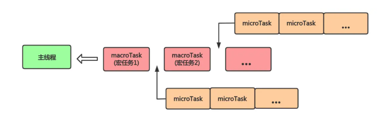
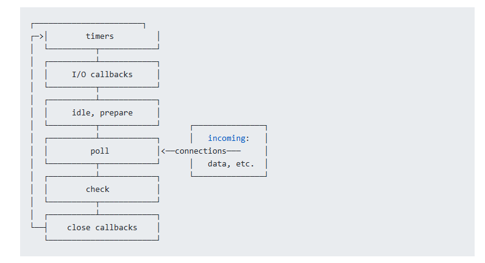

[参考资料JavaScript 运行机制详解：再谈Event Loop](https://www.ruanyifeng.com/blog/2014/10/event-loop.html)  
### 请写出下面代码在不同环境执行的结果
```javascript
console.log(1);
setTimeout(() => {
  console.log(2);
  process.nextTick(() => {
    console.log(3);
  });
  new Promise((resolve) => {
    console.log(4);
    resolve();
  }).then(() => {
    console.log(5);
  });
});
new Promise((resolve) => {
  console.log(7);
  resolve();
}).then(() => {
  console.log(8);
});
process.nextTick(() => {
  console.log(6);
});
setTimeout(() => {
  console.log(9);
  process.nextTick(() => {
    console.log(10);
  });
  new Promise((resolve) => {
    console.log(11);
    resolve();
  }).then(() => {
    console.log(12);
  });
});
```
node 执行结果
1
7
6
8
2
4
3
5
9
11
10
12
```javascript
console.log(1);
setTimeout(() => {
  console.log(2);
  new Promise((resolve) => {
    console.log(4);
    resolve();
  }).then(() => {
    console.log(5);
  });
});
new Promise((resolve) => {
  console.log(7);
  resolve();
}).then(() => {
  console.log(8);
});
setTimeout(() => {
  console.log(9);
  new Promise((resolve) => {
    console.log(11);
    resolve();
  }).then(() => {
    console.log(12);
  });
});
```
浏览器执行结果
1
7
8
2
4
5
9
11
12

解析: 
> 前端的`Event Loop`(事件循环)是指浏览器或`Node.js`运行`JavaScript`代码时，用于处理异步任务的一种机制。其基本原理是不断从任务队列中取出任务并执行，直到所有任务执行完毕。   

`Event Loop`主要分为宏任务和微任务两种类型：  
+ 宏任务：常见的宏任务包括`setTimeout`、`setInterval`、`I/O操作`、`DOM`事件等。  
+ 微任务：常见的微任务包括`Promise`的`then`方法、`async/await`等。   

每次执行完一个宏任务后，会先清空所有的微任务队列，然后再执行下一个宏任务。

宏任务和微任务:
+ 宏任务(macrotask)  
  包括`setTimeOut`、`setInterval`、`setImmediate(node独有)`、`requestAnimationFrame(浏览器独有)`、`I/O`、`UI rendering(浏览器独有)`。  
  
  >I/O（英语：Input/Output），即输入/输出，通常指数据在内部存储器和外部存储器或其他周边设备之间的输入和输出。  

+ 微任务(microtask)  
  包括`process.nextTick(Node独有)`、`Promise.then()`、`Object observe`、`MutationObserver`

+ **Promise构造函数中的代码是同步执行的，new Promise()构造函数中的代码是同步代码,并不是微任务**

### 浏览器Event Loop
主线程运行的时候，产生堆(`heap`)和栈(`stack`),栈 中的代码调用各种外部API,他们在"任务队列"中加入各种事件(`click`,`load`,`done`)。只要栈中的代码执行完毕，主线程就会去读取"任务队列",依次执行那些事件所对应的回调函数。
执行栈中的代码(同步任务),总是在读取"任务队列"(异步任务)之前执行。


### Node.js 中的EventLoop执行宏队列的回调任务有<font color="#ff6347">6个阶段</font>
    + 1.timers阶段:这个阶段执行setTimeout和setInterval预定的callback
    + 2.I/O callback阶段: 执行除了close事件的callbacks,被timer设定的callbacks,setImmediate()设定的callbacks这些之外的callbacks
    + 3.idle,prepare阶段:仅node内部使用
    + 4.poll阶段:获取新的I/O事件,适当的条件下node将阻塞在这里
    + 5.check阶段:执行setImmediate()设定的callbacks
    + 6.close callbacks阶段:执行socket.on('close',……)这些callbacks
### NodeJs中宏队列主要有4个
  + 1.Timers Queue
  + 2.IO Callbacks Queue
  + 3.Check Queue
  + 4.Close Callbacks Queue
  + 这4个都属于宏队列，但是在浏览器中，可以认为只有一个宏队列，所有的macrotask都会被加到这一个宏队列中，在Node.js中，不同的macrotask会被放置在不同的宏队列中。
  
### Node.JS中微队列主要有2个
  + 1.Next Tick Queue:是放置process.nextTick(callback)的回调任务的。
  + 2.Other Micro Queue:放置其他microtask,比如Promise等。
  + 3. 在浏览器中，可以认为只有一个微队列，所有的microtask都会被加到这一个微队列中，在Node.js中，不同的microtask会被放置在不同的微队列中。

## Node.js中的EventLoop过程
+ 1.执行全局`Script`的同步代码
+ 2.执行`microtask`微任务，先执行所有`NextTick Queue`中的所有微任务，再执行`Other Microtask Queue`中的所有任务
+ 3.开始执行宏任务，共6个阶段，从第一个阶段开始执行相应每一个阶段`macrotask`中的所有任务，注意，这里是所有每个阶段宏任务队列的所有任务，在浏览器的`EventLoop`中是只取宏队列的第一个任务出来执行，每个阶段的`macrotask`任务执行完毕后，开始执行微任务，也就是步骤2
+ 4.Timers Queue 执行步骤2--->I/O Queue--->步骤2--->Check Queue--->步骤2--->Close Callback Queue--->步骤2--->Timers Queue
+ 5.这就是Node的Event Loop
### Node 11.x新变化
  + 现在node11在timer阶段的setTimeout,setInterval……和在check阶段的immediate都在node11里面都修改为一旦执行一个阶段里的一个任务就立刻执行微任务队列。为了和浏览器更加趋同。  

### 拓展   
不同的异步任务被分为：宏任务和微任务。
### 运行机制
异步任务的返回结果会被放到一个任务队列中，根据异步事件的类型，这个事件实际上会被放到对应的宏任务和微任务队列中去。  
在当前执行栈为空时，主线程会查看微任务队列是否有事件存在。  
+ 存在，依次执行队列中的事件对应的回调，直至微任务队列为空，然后去宏任务队列中取出最前面的事件，把当前的事件加入到当前指向栈。  
+ 如果不存在，那么再去宏任务队列中取出一个事件并把对应的回调加入当前执行栈；   

当前执行栈执行完毕后会立即处理所有微任务队列中的事件，然后再去宏任务队列中取出一个事件，同一次事件循环中，微任务永远在宏任务之前执行。   

在事件循环中，每一次循环操作称为`tick`,每一次`tick`的任务处理模型是比较复杂的，但关键步骤如下：  
+ 执行一个宏任务（栈中没有就从事件队列中获取）  
+ 执行过程如果遇到微任务，就将它添加到微任务的任务队列中  
+ 宏任务执行完毕后，立即执行当前微任务队列中的所有微任务(依次执行)  
+ 当前宏任务执行完毕，开始检查渲染，然后`GUI`线程接管渲染  
+ 渲染完毕后，`JS`线程继续接管，开始下一个宏任务(从事件队列中获取)  
简单总结一下执行的顺序：  
执行宏任务，然后执行该宏任务产生的微任务，若微任务在执行过程中产生了新的微任务，则继续执行微任务，微任务执行完毕后，再回到宏任务中进行下一轮循环。   



### `node`环境下的事件循环   
和浏览器环境有何不同   
表现出的状态与浏览器大致相同。不同的是`node`中有一套自己的模型。`node`中事件循环的实现依赖`libuv`引擎。`Node`的事件循环存在几个阶段。   
如果是`node10`及之前的版本，`microtask`会在事件循环的各个阶段之间执行，也就是一个阶段执行完毕，就会去执行`microtask`队列中的任务。   
`node`版本更新到11之后，`Event Loop`运行原理发生了变化，一旦执行一个阶段里的一个宏任务(`setTimeout`、`setInterval`和`setImmediate`)就立刻执行微任务队列，跟浏览器趋于一致。下面例子中的代码是按照最新的去进行分析的。

### 事件循环模型   


### 事件循环各阶段详解   
`node`中事件循环的顺序   
外部输入数据——>轮询阶段(`poll`)——>检查阶段(`check`)——>关闭事件回调阶段(`close callback`)——>定时器检查阶段(`timer`)——>`I/O`事件回调阶段(`I/O callbacks`)——>闲置阶段(`idle,prepare`)——>轮询阶段……   
这些阶段的大致功能如下:   
+ 定时器检测阶段(timers):这个阶段执行定时器队列中的回调如`setTimeout()`和`setInterval()`
+ `I/O`事件回调阶段(`I/O callbacks`):这个阶段执行几乎所有的回调。但是不包括`close`事件，定时器和`setImmediate()`的回调。   
+ 闲置阶段(`idle`、`prepare`):这个阶段仅在内部使用，可以不必理会。   
+ 轮询阶段(`poll`):等待新的`I/O`事件，`node`的在一些特殊情况下会阻塞这里。   
+ 检查阶段(`check`):`setImmediate()`的回调会在这个阶段执行。  
+ 关闭事件回调阶段(`close callbacks`):例如`socket.on('close',……)`这种`close`事件的回调。  
#### `poll`
这个阶段是轮询时间,用于等待还未返回的`I/O`事件，比如服务器的回应、用户移动鼠标等等。  
这个阶段的时间会比较长。如果没有其他异步任务要处理(比如到期的定时器)，会一直停留在这个阶段，等待`I/O`请求返回结果。  

#### `check`  
该阶段执行`setImmediate()`的回调函数。   
#### `close`
该阶段执行关闭请求的回调函数，比如`socket.on('close',……)`
#### `timer`阶段   
这是个定时器阶段，处理`setTimeout()`和`setInterval()`的回调函数 。进入这个阶段后，主线程会检查一下当前时间，是否满足定时器的条件。如果满足就执行回调函数，否则就离开这个阶段。
#### `I/O callback阶段`:  
除了以下的回调函数，其他都在这个阶段执行:  
+ `setTimeout()`和`setInterval()`的回调函数  
+ `setImmediate()`的回调函数  
+ 用于关闭请求的回调函数，比如`socket.on('close'，……)`   

[JavaScript中的Event Loop（事件循环）机制](https://segmentfault.com/a/1190000022805523#item-5)  

