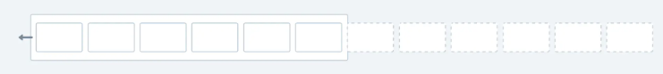

### 实现方法   
#### 通过绝对定位 + 动画延时   
##### 首先，定义HTML的结构如下  
```html
<div class="wrapper">
  <div class="item" style="--count: 1"></div>
  <div class="item" style="--count: 2"></div>
  <div class="item" style="--count: 3"></div>
  <div class="item" style="--count: 4"></div>
  <div class="item" style="--count: 5"></div>
  <div class="item" style="--count: 6"></div>
  <div class="item" style="--count: 7"></div>
  <div class="item" style="--count: 8"></div>
</div>
```    
这里`style="--count:1"`中定义的是`css`自定义属性(也称为CSS变量)。在这个例子中，每个`.item`元素都有一个名为`--count`的自定义属性，其值分别为1到8。    
这些自定义属性可以在`CSS`中被引用，通常用于计算样式值。  

##### 编写`wrapper`样式   
```css
.wrapper {
	--logo-width: 200px;
	--logo-height: 100px;
	--logo-count: 8;
	--duration: 30s;
  width: 90%;
  max-width: 1200px;
  margin-inline: auto;
  position: relative;
  height: var(--logo-height);
  margin-top: 5rem;
  overflow: hidden;
  /* 模糊遮挡效果 */ 
  mask-image: linear-gradient(
    to right,
    rgba(0, 0, 0, 0),
    rgba(0, 0, 0, 1) 20%,
    rgba(0, 0, 0, 1) 80%,
    rgba(0, 0, 0, 0)
  );
}
```
这段代码中
```css
.wrapper {
	--logo-width: 200px;
	--logo-height: 100px;
	--logo-count: 8;
	--duration: 30s;
}
```  
这段`CSS`代码定义了一些自定义属性(也称为`CSS`变量)，这些变量可以在后续的`CSS`规则中被引用和使用。具体来说，这段代码定义了四个变量,这些变量可以在同一作用域内的其他`CSS`规则中通过`var()`函数引用。    

```css
  /* 模糊遮挡效果 */ 
  mask-image: linear-gradient(
    to right,
    rgba(0, 0, 0, 0),
    rgba(0, 0, 0, 1) 20%,
    rgba(0, 0, 0, 1) 80%,
    rgba(0, 0, 0, 0)
  );
```  
这段代码的效果是：  
+ 在最左边`20%`的区域，元素是不可见的。此时遮罩层的颜色为完全透明的黑色，遮罩层是完全透明的，元素的这部分是不可见的。   
+ 从20%到80%的区域，元素是完全可见的。   
+ 在最右边20%的区域，元素是不可见的。   
       
这种渐变遮罩效果通常用于创建平滑的过渡效果，使得元素在进入和退出视图时更加自然。例如，在无限循环滚动动画中，这个遮罩可以用来平滑地隐藏滚动元素的边缘，使其看起来更加流畅。   

##### 定义动画，终点为负的一个`logo`宽度   
```css
@keyframes scrollLeft{
    to {
        left:calc(var(--logo-width)*-1);
    }
}
```  
##### 定义每个`item`的样式    
```css   
.item{
    width:var(--logo-width);
    height:var(--logo-height);
    background-color:red;
    border-radius:6px;
    position:absolute;
    left:calc(var(--logo-width)*var(--logo-count));
    animation-name:scrollLeft;
    animation-duration:var(--duration);
    animation-timing-function:linear;
    animation-iteration-count:infinite;
    /* 动态计算出每个子项的动画延时 */  
    animation-delay: calc(var(--duration) / var(--logo-count) * (var(--logo-count) - var(--count)) * -1);
}
```   
至于隔行错开的样式，可以添加一个`div`容器包裹所有的`item`项目，然后使用`CSS`伪类选择器，对偶数行应用`margin-left`来实现。   

```css
/* 对偶数行的 .item 应用 margin-left */
.item:nth-child(even) {
  margin-left: 10px; /* 根据需要调整间距 */
}
```

#### 通过双份`logo`进行动画循环   

实现思路：  
将每行的长度增加一倍，然后通过循环动画来实现无限循环滚动的效果。

这种方法的缺点在于会让元素数量增加一倍，优点在于容易理解和实现。   

##### 定义`HTML`结构   
```html  
<div class="wrapper">
	<div class="marquee">
		<div class="marquee__group">
		  <div class="item" ></div>
		  <div class="item" ></div>
		  <div class="item" ></div>
		  <div class="item" ></div>
		  <div class="item" ></div>
		  <div class="item" ></div>
		  <div class="item" ></div>
		  <div class="item" ></div>
	  </div>
      <div class="marquee__group">
		  <div class="item" ></div>
		  <div class="item" ></div>
		  <div class="item" ></div>
		  <div class="item" ></div>
		  <div class="item" ></div>
		  <div class="item" ></div>
		  <div class="item" ></div>
		  <div class="item" ></div>
	  </div>
  </div>
  <div class="marquee">
		<div class="marquee__group">
		  <div class="item" ></div>
		  <div class="item" ></div>
		  <div class="item" ></div>
		  <div class="item" ></div>
		  <div class="item" ></div>
		  <div class="item" ></div>
		  <div class="item" ></div>
		  <div class="item" ></div>
	  </div>
      <div class="marquee__group" aria-hidden="true">
		  <div class="item" ></div>
		  <div class="item" ></div>
		  <div class="item" ></div>
		  <div class="item" ></div>
		  <div class="item" ></div>
		  <div class="item" ></div>
		  <div class="item" ></div>
		  <div class="item" ></div>
	  </div>
  </div>
</div>
```
##### 接着定义`CSS`样式和动画   
```css   
  .wrapper {
	--logo-width: 200px;
	--logo-height: 100px;
    --gap: calc(var(--logo-width) / 14);
    --duration: 60s;
    --scroll-start: 0;
    --scroll-end: calc(-100% - var(--gap));
    
    display: flex;
    flex-direction: column;
    gap: var(--gap);
    margin: auto;
    max-width: 100vw;   

    .marquee {
        display: flex;
        overflow: hidden;
        user-select: none;
        gap: var(--gap);
        mask-image: linear-gradient(
            to right,
            hsl(0 0% 0% / 0),
            hsl(0 0% 0% / 1) 20%,
            hsl(0 0% 0% / 1) 80%,
            hsl(0 0% 0% / 0)
        );
    }
    .marquee__group {
        flex-shrink: 0;
        display: flex;
        align-items: center;
        justify-content: space-around;
        gap: var(--gap);
        min-width: 100%;
        animation: scrollLeft var(--duration) linear infinite;
        }

    .wrapper .marquee:nth-child(even) {
        margin-left: calc(var(--logo-width) / -2);
    }
    .item {
  width: var(--logo-width);
  height: var(--logo-height);
  background-color: red;
  border-radius: 6px;
}

@keyframes scrollLeft {
  from {
    transform: translateX(var(--scroll-start));
  }
  to {
    transform: translateX(var(--scroll-end));
  }
}
}
```
