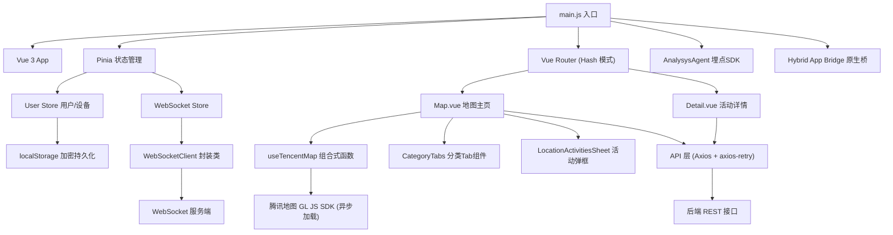

功能流程：  
打开首页或地图页 → 定位 → 浏览主题分类标签 → 选择感兴趣的活动类型 → 点击活动点位查看详情 → 进入详情页 → 点击导航，前往目的地  

地图：腾讯地图（ `GL JS（map.qq.com/gljs`，`TMap.MultiMarker` + 自定义 `DOMOverlay`）。  

流程图

> `graph`声明"这是一个流程图"，`TD`定义图表的"布局方向"。  

