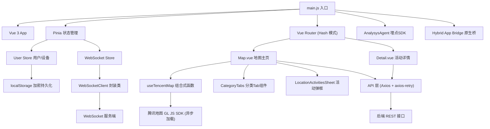
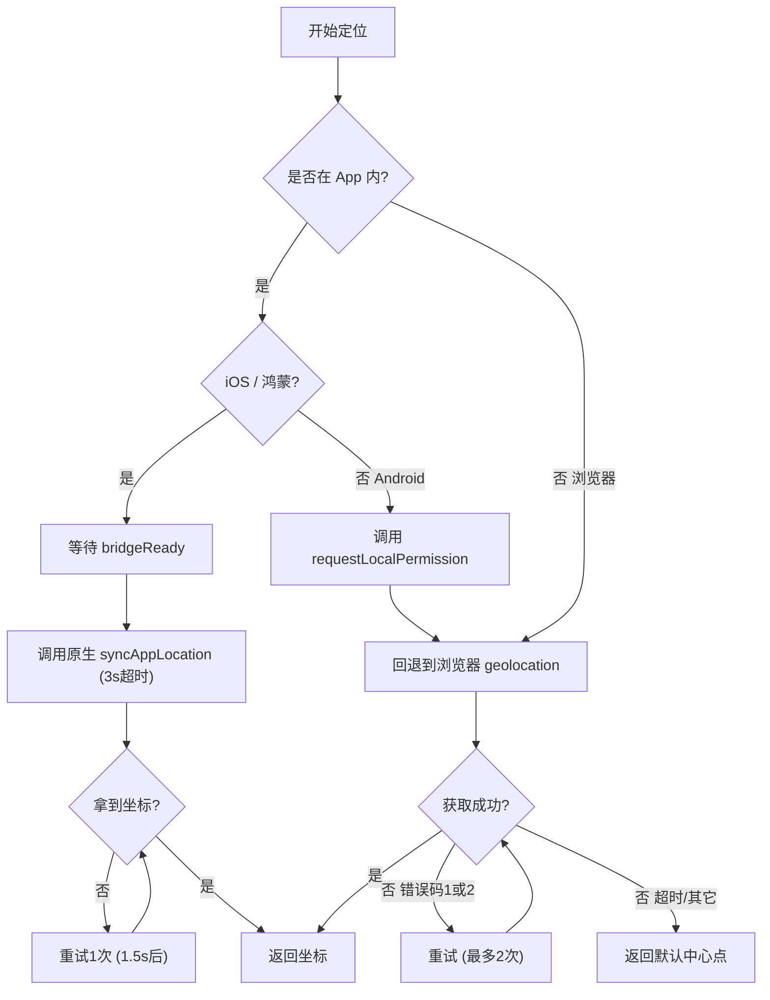
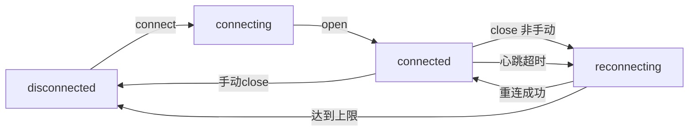

功能流程：  
打开首页或地图页 → 定位 → 浏览主题分类标签 → 选择感兴趣的活动类型 → 点击活动点位查看详情 → 进入详情页 → 点击导航，前往目的地  

地图：腾讯地图（ `GL JS（map.qq.com/gljs`，`TMap.MultiMarker` + 自定义 `DOMOverlay`）。  

流程图

> `graph`声明"这是一个流程图"，`TD`定义图表的"布局方向"。  

| 层级 | 技术选型 |
|------|----------|
| 框架 | Vue 3（Composition API + `<script setup>`） |
| 构建 | Vite 4 + @vitejs/plugin-legacy（兼容 Android ≥ 7） |
| 状态管理 | Pinia |
| 路由 | Vue Router 4（Hash 模式） |
| UI 组件库 | Vant 4（unplugin-vue-components 自动按需引入） |
| 地图 | 腾讯地图 GL JS（动态 script 注入加载） |
| 实时通信 | 原生 WebSocket + 自研封装类 |
| HTTP | Axios + axios-retry（指数退避重试） |
| 样式 | Less 全局注入 + postcss-px-to-viewport（750px 设计稿 → vw） |
| 埋点 | AnalysysAgent SDK |
| 混合开发 | 原生 App Bridge |

### 核心设计模式  
1.`Composable`组合函数——`useTencentMap.js`将地图`SDK`加载、标注图层、`DOMOverlay`标签、生命周期清理全部封装为一个可复用的`composable`  
2.**单`WebSocket`连接模型**——`Store`内维护唯一`shallowReactive`连接对象，同用户切组走`messageType：2`协议避免重建连接  
3.**数据适配器模式——`categories.js`**中的`adaptPointToMarker`解耦后端接口结构与前端`UI`模型  
4.**分类缓存**——`Map`按`categoryKey`缓存已请求的点位，避免重复请求  

二、项目难点  
难点1：跨平台地理定位（最大难点）   

核心挑战：  
+ `ios/鸿蒙`：`WebView`的`navigator.gelocation`不可靠，必须走原生`Bridge`回调。
+ `Android App`内：需先调`requestLocalPerission()`授权，但授权后坐标不会立即可用，需要重试  
+ **`Bridge`就绪等待**：必须监听`bridgeReady`事件，有超时兜底，否则原生API调用会空等  
+ **所有路径都必须优雅降级**到默认中心点，不能让页面卡在"定位中"

### 难点2：`WebSocket`连接生命周期管理  
`Store + WebSocketClient`类共同维护了一个复杂的状态机：  

核心挑战：  
+ **智能重连**：指数退避+随机抖动+上限`30S`;浏览器离线时只尝试一次，等网络恢复再触发  
+ **连接锁**：`_connectLock`防止并发`connect`调用  
+ **心跳死亡监测**：每`30S`发`ping`,`45S`内没收到任何服务端数据——>判定为死连接，主动`close`触发重连  
+ **无感切组**：同用户/设备切换`chatGroupId`时，优先发`messageType：2`协议消息，不重建连接  
+ **发送前补连**：`sendQuestion()`发现断开——>尝试一次重连——> 等待`5s`连接就绪——>失败则注入本地"服务断联"提示  
+ 鉴权码缓存：`chatSecret`按`userId`缓存，每次`beforeConnect`时`force`刷新  
+ 匿名设备支持：未登录用户通过`udid`(设备ID)替代`userId`连接  

### 难点3：腾讯地图`SDK`动态加载&`DOMOverlay`覆盖物  
`useTencentMap.js`的实现难点：  
+ **`SDK`异步加载**：采用`script.onload + 100ms 轮询 window.TMap`双重检测，因为腾讯地图`SDK`的`onLoad`触发时`TMap`可能还未挂载  
+ 自定义`DOMOverlay`标签类：继承`TMap.DOMOverlay`，需要手动管理`DOM`创建、位置投影更新（`projectToContainer`）、事件绑定  
+ `z-index`分层博弈：  
    + 页面背景装饰图层`z-index：1001`(高于地图默认覆盖物1000)
    + 标签覆盖物`z-index：1002 + pointer-events：auto`（保证可点击）  
    + `pointer-events：none`加在背景图上（保证点击穿透到地图）  

+ **移动端触摸优化：** 同时绑定 `click`和`touchstart`,解决部分机型`click`延迟/失效问题  
+ **生命周期清理：**`onUnmounted`时移除事件监听、移除覆盖`map.destroy()`  

### 难点4：多端混合环境适配  
应用必须在 4+ 种运行环境中正确工作：

| 环境 | UA 特征 | 定位方式 | Bridge |
| --- | --- | --- | --- |
| customApp iOS | customApp ios | 原生回调 | ✅ |
| customApp Android | customApp | 原生权限 + 浏览器回退 | ✅ |
| 鸿蒙 / ArkWeb | harmonyos / arkweb | 原生回调 | ✅ |
| 独立浏览器 | 标准 UA | navigator.geolocation | ❌ |    

每种环境的 UA 判断、权限流程、Bridge 可用性都不同。  

### 难点5：用户会话加密持久化  
+ 用户信息使用`crypto-js`加密后存入`localStorage`(`paramsEncryption/paramsDecrypt`)  
+ 24小时过期机制，启动时自动检验并清理过期数据  
+ `configId`隔离存储`key`(___x_x_x_{configId}),支持同一域名下多实例部署  
+ 双重身份模型：已登录用户（`id/token`）vs 匿名设备（`deviceId/uuid`）,`WebSocket`连接参数自动同步
