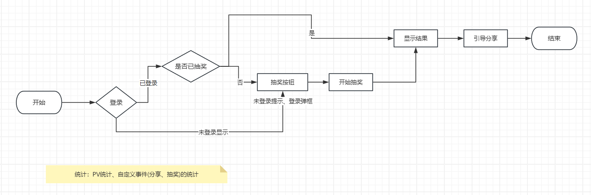

### 开发一个`H5`抽奖页面，后台需要提供哪些接口`API`?

接口就是功能，分析一下当前页面有哪些功能。   

### 常见答案  
+ 抽奖接口   
+ 用户信息接口  
+ 是否已经抽奖  

### 正常思考流程   
先梳理页面的业务流程

  

+ 登录，获取用户信息，用户是否已抽奖
+ 抽奖接口  
+ 统计接口，分享微信`JSSDK`信息(需要和`PM`确定)   

让页面动起来，分析业务流程。  

