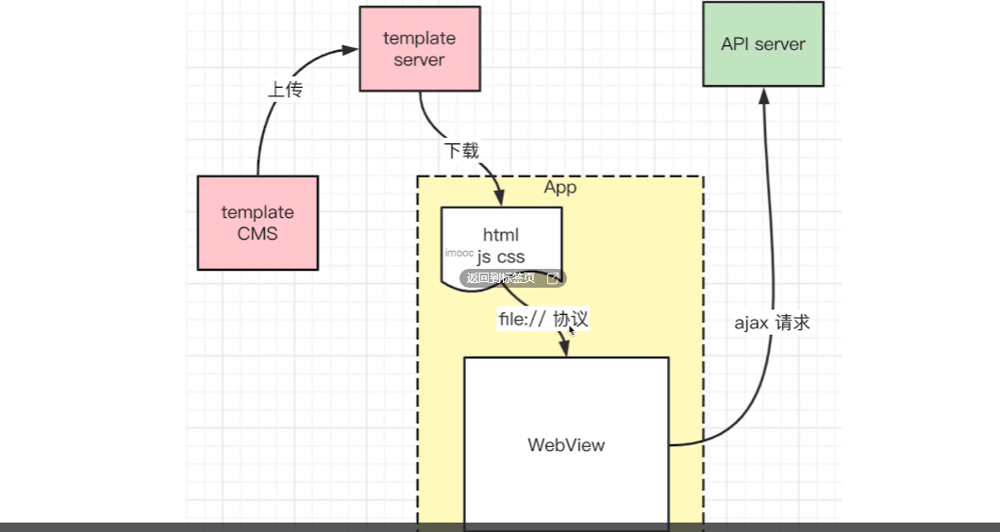
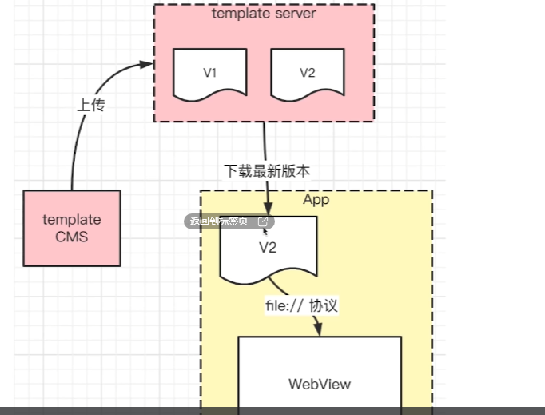

### `Hybrid`模版是如何更新的？   

在APP中是如何加载`H5`页面的?     

> APP会先把页面下载到本地，然后再通过`file://`协议去加载这些本地资源，然后通过`ajax`去请求业务数据进行页面渲染。   

> 在网页中通过省略协议头的方式加载资源，比较好的一种方式，根据当前网页的协议，来去拼接上协议头。

> 注：在`Hybrid`中是通过`fill://`协议去加载资源的，会自动拼接成`file://`。

#### `Hybrid`加载`H5`版本控制  

   

#### `App`何时下载新版本？  
+ `App`启动时检查，下载  
+ 实时(每隔`5min`)检查、下载  
延迟使用  
+ 立刻下载，使用会影响性能(下载需要时间，网络环境不同)
+ 检查到新版本，先在后台下载，此时先用着老版本  
+ 待新版本下载完成，再替换为新版本，开始使用   
  

### APP预取(Pre-fetching)   
#### 思考`APP`预取是什么意思？   
在`Hybrid`应用开发中，**预取**(`Pre-fetching`)是指在用户尚未明确请求某个页面或资源之前，提前将这些页面或资源下载到本地的过程。具体来说，预取可以分为以下几个方面：   

+ **提前下载页面资源**：`APP`会在用户打开某个页面时，或者在后台任务中，提前下载用户接下来会访问的页面资源。这样，当用户实际点击进入这些页面时，页面可以立即显示，而不需要等待网络请求和资源下载的时间。   
+ **本地缓存**:下载的资源会被缓存在本地存储中，通常使用文件系统或数据库。这样，即使在没有网络连接的情况下，用户也可以访问这些已经预取的页面。   
+ **提升用户体验**:通过预取，可以显著减少页面加载时间，提高应用的响应速度，从而提升用户体验。    

#### 总结  
`APP`预取是一种优化技术，通过提前下载和缓存用户可能需要的资源，提升应用的加载速度和用户体验。在`Hybrid`应用中，预取特别适用于`H5`页面的加载，通过`file//`协议从本地加载预取的资源，结合`AJAX`请求动态数据，实现快速响应和流畅的用户体验。   

