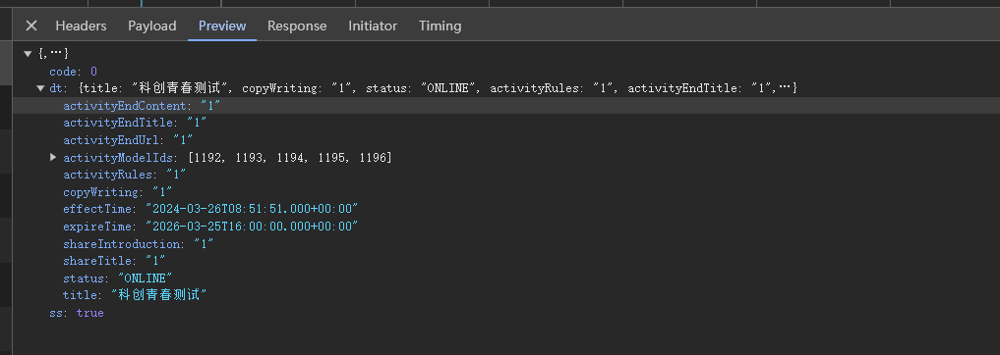
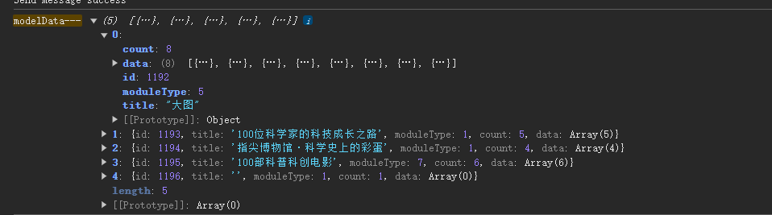
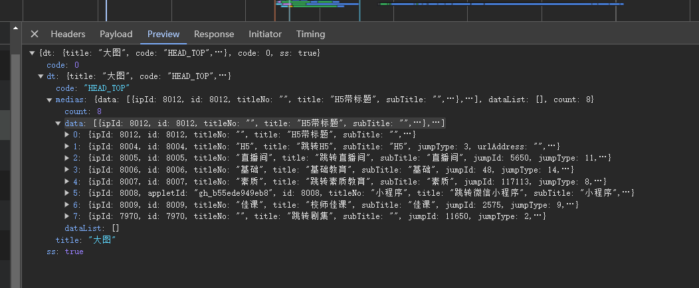

### 核心代码   
// index.js   
#### `APP`调用`H5`的方法
+ 1.检查`Vue`是否初始化完成；  
> `checkapp`  
+ 2.`App`回调`H5`   
> `bridgeCallback`   
+ 3.`App`里面底部分享弹窗   
> `shareStart`   
+ 4.`App`里面分享成功返回`app`触发这个   
> `shareSuccess`     
+ 5.`App`页面跳转，暂停`H5`页面上的播放器   
> `pauseVideo`  
+ 6.`App`暂停视频   
> `pauseVideoOnly`
+ 7.`App`里面`goback`返回页面   
> `webViewDidFinishNavigation`

+ 8.`App`里面网页页面出现在屏幕上——（网页不一定加载完成）    
> `webViewDidAppear`

+ 9.`App`启用分享按钮   
> `enableShareButton`   

+ 10.`App`禁用分享按钮   
+ `disableShareButton`   

### 页面业务逻辑   
+ `commonLiDom` 存储各个模块的`li`,`key`值为`1-9`，`value`为`dom` 
+ `commonPageData` 全局变量  
+ `modelData` 模块数据   
+ `lineMoreModuleType` 行更多模块类型  
+ `boxMoreModuleType` 盒子更多模块类型  
+ `boxMoreMaxLength` 盒子最大长度   
+ `boxMoreIndex` 当前渲染第几个横向拖拽模块   

<!-- 请求接口 -->
> 获取模块ID列表和模块数据   
> `/cms/api/c/project/modelList`  

;  

根据接口数据返回组织`modelData`模块数据
```javascript
modelData = res.dt.activityModelIds.map((id, index) => ({
    id: id,
    title: "",
    moduleType: $(".app-module").eq(index).attr("data-moduleType") - 0, //通过后台生成的html获取模块类型
    count: 1, //初始设为1用于首次加载不被认定为已加载完成
    data: [],
}))
```
   

> 获取模块数据接口的请求参数  
> `getRequestParams`方法，若是没有传递`requestModule`参数(`要请求模块参数`)   

```javascript
// 未传`requestModule`自动查找   
// 通过`modelData`模块数据,获取`getRequestParams`请求参数
// 判断是否为横向滚动模块，如果是则只要有数据就往下加载，否则必须加载完才往下加载,`lineMoreModuleType`横向滚动类型集合。
if (!requestModule) {
    for (let i = 0; i < modelData.length; i++) {
        const isLineModule = lineMoreModuleType.some(d => d==temp.moduleType);   
        // loadSuccess 是否加载成功   
        // modelData[i].count 模块数据数量   
        const loadSuccess = temp.count == 0 ? true:isLineModule?temp.data.length:temp.data.length >= temp.count;
        // 第二部分判断：此处是另一个条件判断，即 `isLineModule ? temp.data.length : temp.data.length >= temp.count`。
        // 如果 `isLineModule` 为 `true`，则取 `temp.data.length` 的值作为结果。
        // 如果 `isLineModule` 为 `false`，则判断 `temp.data.length >= temp.count` 是否成立。
        if (!loadSuccess) {
            requestModule = temp;
            break;
        }
    }
}
// 所有数据加载完毕 返回`false`给外部处理  
if (!requestModule) {
    return false;
}
return {
    activityCode: ACTIVITY_CODE,
    activityModelId: requestModule.id,
    userId: userId ? userId : "",
    token: token ? token : "",
    page,
    limit,
}
```
这段代码是用于获取**模块数据接口**的请求参数的函数。其作用可以总结如下:  
1.自动查找未加载完的模块数据   
2.返回加载下一个模块的请求参数  
3.处理特殊模块类型  
4.加载完成判断   

> 根据模块ID获取**模块数据详情**   
> `/cms/api/c/project/media/byModel`  



```javascript
// 根据模块ID获取模块数据, isCommon是否为正常的下拉加载
function requestModelDataList(params, isCommon = true) {
    // 根据params，获取当前模块的序列   
    const index = modelData.findIndex(d => d.id == params.activityModelId);
    // 请求数据模块数据详情  
    ajax({
        url: host + "/cms/api/c/project/media/byModel",
        type: "POST",
        async: true,
        dataType: "json",
        data: params,
        success: (response) => {
        let res = JSON.parse(response);
        if (res.ss) {
            // 模块数据
            let list = res.dt?.medias?.data || [];
            modelData[index].data.push(...list);
            modelData[index].title = res.dt?.title || "";
            // 列表项目总数
            let maxCount = Infinity;
            let count = res.dt?.medias?.count || 0;
            if (boxMoreModuleType.some(d => d == modelData[index].moduleType)) {
                maxCount = boxMoreMaxLength
            }
            modelData[index].count = Math.min(maxCount, count);
            // 模块标题
            $(".app-module").eq(index).attr("data-title", res.dt?.title || "");
            $(".app-module").eq(index).find(".app-module-title-text").html(res.dt?.title || "");
            if (modelData[index].count) {
                $(".app-module").eq(index).attr("style", "display:block")
            }
            if (isCommon) {
                // 计算当前是否加载完成,未完成继续加载 以下三个不取实际长度 MODULE_HORIZONTAL = 1 横图行 MODULE_SQUARE = 2 // 方图行 MODULE_VERTICAL = 3 // 竖图行
                let isSwiper = [...lineMoreModuleType, ...boxMoreModuleType].some(d => d == modelData[index].moduleType)
                commonPageData.loadingLength += isSwiper ? commonPageData.swiperLength : list.length;
                // 当前页未加载完 有数据的话继续加载
                if (commonPageData.loadingLength < commonPageData.pageSize && getRequestParams()) {
                    loadData()
                } else {
                    // 加载完毕 loadinglength置为0
                    commonPageData.loadingLength = 0;
                    commonPageData.loading = false;
                    // 数据未渲染完单屏 首屏高度设定上限1500px防止无限加载
                    let allModuleHeight = 800 || $(".app-module-list")[0].clientHeight;
                    let windowHeight = Math.min(1500, window.innerHeight || document.documentElement.clientHeight || document.body.clientHeight);
                    if (allModuleHeight < windowHeight && getRequestParams()) {
                        loadData()
                    }
                }
            } else {
                // 不是滚动加载直接关闭loading
                modelData[index].loading = false;
            }

            if (XAData(res).get("dt").get("code").value() === CODE_VIDEO_LIST) {
            // 视频列表模块
            var videoModelIndex = index;

            // 如果是第一次，把容器HTML先加上
            if ($(".app-list-more").length === 0) {
                $(".app-module-main").eq(videoModelIndex).html(`<!--上滑翻页列表容器-->
                    <ul class="app-list-more">
                    </ul>
                    <!--列表底线-->
                    <div
                        class="app-list-bottomline"
                        id="app-list-bottomline"
                    >${getBottomText()}
                    </div>
                    `);
                // 点击短视频集锦模块的播放按钮
                $(".app-list-more").on("click", ".app-list-more-item-pic-play", function () {
                // 播放按钮点击处理
                clickModuleMorePlay($(this));
                });
            }

            // 追加列表项目HTML
            let htmlStr = ``;
            list.forEach(item => {
                htmlStr += "  <!--单项-->\n" +
                "  <li\n" +
                "    class=\"app-list-more-item\"\n" +
                "    data-id=\"" + XAData(item).get("id").value() + "\"\n" +
                "  >\n" +
                "    <!--视频外容器-->\n" +
                "    <div class=\"app-list-more-item-video\">\n" +
                "      <!--视频容器-->\n" +
                "      <div class=\"app-list-more-item-video-wrap\">\n" +
                "        <!--视频本身-->\n" +
                "        <video\n" +
                "          controls\n" +
                "          controlslist=\"nodownload " + (bestvPlus && getUrlParam("level") == "top" ? 'nofullscreen' : '') + "\"\n" +
                "          playsinline=\"playsinline\"\n" +
                "          poster=\"" + XAData(item).get("mediaCover").value() + "\"\n" +
                "          src=\"" + XAData(item).get("qualities").get("0").get("originalUrl").value() + "\"\n" +
                "          webkit-playsinline=\"true\"\n" +
                "          x-webkit-airplay=\"allow\"\n" +
                "          x5-video-orientation=\"portrait\"\n" +
                "          x5-video-player-fullscreen=\"false\"\n" +
                "          x5-video-player-type=\"h5\"\n" +
                "        >\n" +
                "          <source src=\"" + XAData(item).get("qualities").get("0").get("originalUrl").value() + "\">\n" +
                "        </video>\n" +
                "      </div>\n" +
                "\n" +
                "      <!--视频封面-->\n" +
                "      <div class=\"app-list-more-item-cover\">\n" +
                "        \n" +
                "      </div>\n" +
                "\n" +
                "      <!--阴影遮罩-->\n" +
                "      <div class=\"app-list-more-item-pic-mask\"></div>\n" +
                "\n" +
                "      <!--播放按钮-->\n" +
                "      <div class=\"app-list-more-item-pic-play\"></div>\n" +
                "    </div>\n" +
                "\n" +
                "    <!--标题容器-->\n" +
                "    <div class=\"app-list-more-item-title\">\n" +
                "      <!--标题文本-->\n" +
                "      <div class=\"app-list-more-item-title-text\">" + XAData(item).get("title").value() + "</div>\n" +
                "      <!--视频时长-->\n" +
                "      <div class=\"app-list-more-item-title-length\"></div>\n" +
                "    </div>\n" +
                "  </li>";

            });

            $(".app-list-more").append(htmlStr);

            // 短视频集锦模块，重新注册播放结束事件的监听
            $("video").off("ended");

            $("video").on("ended", function () {
                // 当前视频退出全屏
                this.webkitExitFullScreen();

                let currentVideo = $(this);
                let currentIndex = $("video").index(currentVideo);
                // 退出全屏有动画，所以延迟执行自动播放下一个视频
                setTimeout(function () {
                // 自动播放下一个视频
                playNextVideo(currentIndex);
                }, 200);
            });

            }
            if (modelData[index].count) {
            refreshModelHtml(index, params.activityModelId);
            }

        } else {
            toastErrorMessage(res.em);
        }
        },
        error: (error) => {
            console.log(error);
        }
  });
}
```


// 更新某个模块的`HTML`结构   
// `modelIndex`，从上往下顺序的模块索引   
> `function refreshModelHtml()`

```javascript
// `modelIndex`，从上往下顺序的模块索引   
function refreshModelHtml(modelIndex，modelId) {
  let module = $(".app-module").eq(modelIndex);
  let container = module.find(".app-module-main");
  let moduleType = module.attr("data-moduleType") - 0;
  let isFirstLoad = !container.children().length;
  if (moduleType === MODULE_HORIZONTAL) {
    // 横图行
    container.load("module-horizontal.html", function (responseTxt, statusTxt) {
        if (statusTxt === "success")
        // 若加载成功，则刷新模块内容
        refreshModelContent(modelIndex, moduleType, container);
    });
  } 
}else if (moduleType === MODULE_SQUARE) {
    if (!isFirstLoad) {
      refreshModelContent(modelIndex, moduleType, container, false);
      return
    }
    container.load("module-square.html", function (responseTxt, statusTxt) {
      if (statusTxt === "success")
        refreshModelContent(modelIndex, moduleType, container);
    });
  }
```

> 更新某个模块的HTML内容——填充数据   
> `refreshModelContent`

```javascript
function refreshModelContent(modelIndex, moduleType, container, isFirstLoad = true){
    let d = modelData[modelIndex].data;
    if(!isFirstLoad){
        d = getLoadingData(modelData[modelIndex]);
    }else{
        // 存储默认的li到`commonLiDom`对象中,`key`值是`moduleType`  
        // `clone()`方法生成被选元素的副本，包含子节点、文本和属性。 $(selector).clone(includeEvents) includeEvents 可选。布尔值。规定是否复制元素的所有事件处理。默认地，副本中不包含事件处理器。
        commonLiDom[moduleType] = container.find("li").eq(0).clone();
    }
}
```

> 非首次加载
> 获取`getLoadingData`


### 问题整理  
#### 1.单排横图  
新增头像-昵称显示


`container`—— `div.app-module-main`  
`MODULE_HORIZONTAL`—— 横图行  —— `max:40`  
`const boxMoreModuleType = [MODULE_HORIZONTAL];`
`boxMoreMaxLength` //40  
`1boxMoreIndex` //当前渲染第几个横向拖拽模块， 0开始  
`module-horizontal.html` 横图行 —— `1`


cc _ 687
ccItem _ 687  
carousel _ 688 ,166,179,183

#### 2.方图行  
方图行需要分页加载，一页请求10条。滚动加载后续内容。  

`MODULE_SQUARE`  - 2 方图行 `module-square.html`

#### 3.多横图（一大多小）  
`MODULE_HORIZONTALMOREBIG` - 9 大横图加多横图  `module-horizontalMoreBig.html`

#### 4.短视频   

### 页面修改内容整理  
1.html 页面 引入hls.js  
2.修改文件 `common.js`，`index.js`  
3.引入相关新的模版页面  

```javascript
const currentControlVideo = 'short_video_' + shortVideoIndex;
document.styleSheets[0].insertRule('.' + currentControlVideo + '::-webkit-media-controls-timeline {  display: none !important; }', 0);
```

短视频列表  
挂载直播间的流程 直接播放直播流？

#### 竖图自定义模版   


1.`MODULE_HORIZONTAL_SETTINGS` 自定义横图行——  11  
2.`MODULE_SQUARE_SETTINGS` 自定义方图行—— 12  
3.`MODULE_VIDEO_LIST_SETTINGS` 自定义短视频—— 13
4.`MODULE_HORIZONTALSWIPE_SETTINGS` 自定义大图轮播——  14  
5.`MODULE_HORIZONTALROLL_SETTINGS` 自定义单排横图——  15
6.`MODULE_HORIZONTALMOREBIG_SETTINGS` 自定义大横图加多横图——  16
7.`MODULE_PIC_HORIZONTAL_SETTINGS` 自定义图横版———  17  
8 `MODULE_PIC_VERTICAL_SETTINGS` 自定义图竖版———  18  
请求对应模版数据接口
cms/api/c/project/media/byModel
```
{"activityCode":"model","activityModelId":1218,"userId":"","token":"","page":0,"limit":20}
```
模版页相关修改  
1.`MODULE_HORIZONTAL_SETTINGS` 自定义横图行——  11  
添加模版属性  
data-author= "1" // 1显示 2不显示   
data-toggleMode = "slider" //slider 滑动 button 按钮

2.`MODULE_SQUARE_SETTINGS` 自定义方图行—— 12  
添加模版属性  
data-author= "1" // 1显示 2不显示  
data-contentTitle ="1" 1 显示 2不显示

3.`MODULE_VIDEO_LIST_SETTINGS` 自定义短视频—— 13  
添加模版属性  
data-author= "1" // 1显示 2不显示  
data-cornerMarkers= "1" // 1显示 2不显示 

4.`MODULE_HORIZONTALSWIPE_SETTINGS` 自定义大图轮播——  14  
5.`MODULE_HORIZONTALROLL_SETTINGS` 自定义单排横图——  15  
6.`MODULE_HORIZONTALMOREBIG_SETTINGS` 自定义大横图加多横图——  16  
添加模版属性  
data-author= "1" // 1显示 2不显示  

7.`MODULE_PIC_HORIZONTAL_SETTINGS` 自定义图横版———  17   
添加模版属性  
data-author= "1" // 1显示 2不显示  

8 `MODULE_PIC_VERTICAL_SETTINGS` 自定义图竖版———  18   
添加模版属性  
 data-author= "1" // 1显示 2不显示  


// 当前模版项目改动文件有哪些   
1.carousel.js
`/js/es5/carousel.js`
2.config.js
`js/config.js`
3.common.js
`/js/es5/common.js`
4.config30005.js

5.模版页需要引入`hls.js`文件  

6.index.js
`/js/es5/index.js`

7.index.css
`/atm/css/index.css`


let MODULE_HORIZONTAL = 1 // 横图行 max:40
let MODULE_SQUARE = 2 // 方图行 横向滚动
let MODULE_VERTICAL = 3 // 竖图行 横向滚动
let MODULE_VIDEO_LIST = 4 // 短视频集锦
let MODULE_HORIZONTALSWIPE = 5 // 大图轮播
let MODULE_HORIZONTALROLL = 6 // 单排横图 横向滚动
let MODULE_VERTICALROLL = 7 // 单排带标题竖图 横向滚动
let MODULE_HORIZONTALMORE = 8 // 多横图
let MODULE_HORIZONTALMOREBIG = 9 // 大横图加多横图
let MODULE_ADVERTISEMENT = 10 // 大横图加多横图  


  <link
    href="css-test/common.css"
    rel="stylesheet"
  >
  <link
    href="css-test/index.css"
    rel="stylesheet"
  >
  <link href="css-test/swiper-bundle.min.css" rel="stylesheet">
  </link>
<script type="text/javascript" src="js/es5-test/config.js?v=1"></script>
<script type="text/javascript" src="js/es5-test/common.js"></script>
<script type="text/javascript" src="js/lib/hls.js"></script>

<script type="text/javascript" src="js/es5-test/carousel.js"></script>
<script type="text/javascript" src="js/es5-test/index.js?v=1"></script>


link css/ 文件夹改成 css-test/
script 标签 js/es5 js/es5-test
js/config.js   改成 js/es5-test/config.js 测试
线上 js/es5/config.js js/config.js 

加一个lib依赖  
<script type="text/javascript" src="js/lib/hls.js"></script>


短视频模块 —— 直播间逻辑修改   
跳转类型选择——直播——4  
综艺直播间 —— jumpType —— 6 
绿叶育人直播间 —— jumpType —— 11 
体育直播间 —— jumpType —— 25  
竖屏直播间 —— jumpType —— 28

#### 自定义标题颜色修改
```css
    /*TODO 横图行模块-标题-颜色*/
    .app-list-vertical-item-title,
      /*TODO 竖型图行模块-标题-颜色*/
    .app-list-horizontal-item-title,
      /* TODO 轮播图标题-颜色 */
    .mySwiper_title {
      color: #666FF;
    }

```

```css
    /*TODO 横图行模块-标题-颜色*/
    .app-list-vertical-item-title,
     /*TODO 自定义-横图行模块-标题-颜色*/
    .app-list-settings-vertical-item-title,
      /*TODO 竖型图行模块-标题-颜色*/
    .app-list-horizontal-item-title,
      /* TODO 轮播图标题-颜色 */
    .mySwiper_title {
      color: #6666FF;
    }

```
模版新增类型

9. MODULE_HORIZONTALMORE_SETTINGS = 19  // 自定义多横图无大图模式  

模版`css`修改
```css
    /*TODO 横图行模块-标题-颜色*/
    .app-list-vertical-item-title,
    /*TODO 自定义-单排横图行模块-标题-颜色*/
    .app-list-settings-vertical-item-title,
    /*TODO 自定义- 大横图加多横图-标题-颜色*/
    .app-list-setting-module-horizontalMoreBig-vertical-item-title,
    /*TODO 自定义-多横图模块-标题-颜色*/
    .app-list-setting-module-horizontalMore-vertical-item-title,
    /*TODO 自定义-横图行模块-标题-颜色*/
    .app-list-setting-module-horizontial-vertical-item-title,
    /*TODO 竖型图行模块-标题-颜色*/
    .app-list-horizontal-item-title,
    /*TODO 自定义-方图行模块-标题-颜色*/
    .app-list-settings-horizontal-item-title,
    /*TODO 自定义-短视频模块-标题-颜色*/
    .app-list-setting-more-item-title-text,
    /* TODO 轮播图标题-颜色 */
    .mySwiper_title,
    /* TODO 自定义-轮播图标题-颜色 */
    .swiper-slide-setting-title,
    /* TODO 自定义-轮播图创作者昵称-颜色 */
    .swiper-slide-setting-creator-nickname,
    /* TODO 自定义-图-标题-颜色 */
    .app-list-setting-module-pic-setting-item-title {
      color: #6666FF !important;
    }
```

