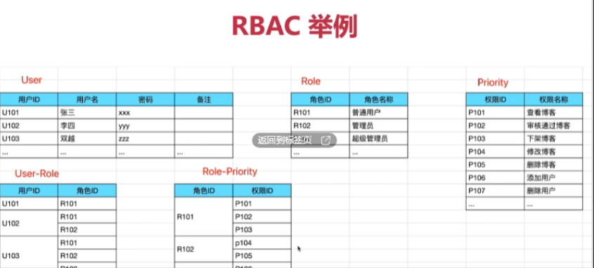

### 怎么设计一个用户-角色-权限的模型和功能   

> 考察知识点：`RBAC`-`Role-based access control` 基于角色的访问控制   

`RBAC`-三个模型，两个关系   

**用户**---关系---**角色**---关系---**权限**  

  

#### 功能模块   
+ 用户管理：增删改查，绑定角色  
+ 角色管理：增删改查，绑定权限   
+ 权限管理：增删改查   

"设计"就是**数据模型(关系)+如何操作数据[功能]**  

#### `RBAC-(Role-based access control)`   
`RBAC`(基于角色的访问控制)主要的作用包括：  

+ **实现访问控制**：通过定义不同的角色，并给这些角色分配不用的权限，从而实现对系统资源的访问控制。确保只有授权的用户才能访问特定的资源或执行特定的操作。  
  
+ **简化权限管理**：在大型组织中，直接管理每个用户的权限是非常复杂且容易出错的。`RBAC`通过将将权限与角色而不是个人关系联系起来，大大简化了权限管理过程。管理员只需要管理少数几个角色及其权限，而不需要单独配置每个用户的权限。  
     
+ **支持灵活的权限调整**：当组织结构发生变化或业务需求调整时，可以通过修改角色的权限来快速适应变化，无需逐一更改用户的权限设置。   

+ **提高安全性**：通过细粒度的权限控制，可以最小化用户访问不必要的资源的风险，减少潜在的安全威胁。   
+ **促进合规性**：许多行业标准和法规要求实施严格的访问控制措施。`RBAC`有助于满足这些合规性要求，确保只有经过授权的人员才能访问敏感数据或关键系统。   

综上所述，`RBAC`是一种有效的方法，用于管理和控制用户对系统资源的访问，同时提高了系统的安全性和管理效率。     

